# Building a model

> [!NOTE]
>
> ### This section will introduce you to
>
> - creating a model using a step-by-step process.

Building a model is a complex process. Let’s assume that you have
already defined the objective and scope and that you have a sketch of
all important elements of the model (see section “Getting started”). It
seems that you are ready to go!

A model in shiny rrisk consists of so-called nodes. You may also define
fixed parameters and functions available for the definition of nodes.

|                                                |                                                                                                                |
|------------------------------------------------|----------------------------------------------------------------------------------------------------------------|
| Add node    | Create a new node and launch its description and mathematical definition.                                      |
| Check model | Verify that a simulation model can be built from the mathematical and numerical model input you have provided. |

> [!WARNING]
>
> ### Avoid loss of your data
>
> Remember to save your model after adding each node.

## Creating a node

> [!NOTE]
>
> ### This section will introduce you to
>
> - the integrated annotation template that is linked to the creation of
>   a node and will guide you through a comprehensive documentation.

A so-called “node” in shiny rrisk is what you would refer to as a
parameter or numerical model input. You will see later on that model
parameters are actually nodes if you represent your model as a graph.
This enables us to use powerful tools for visualisation and analysis.

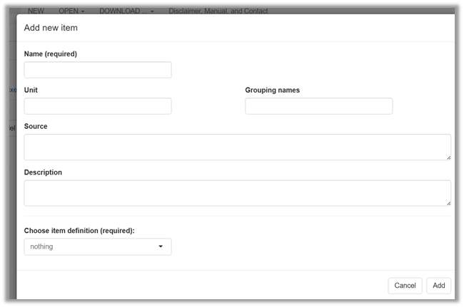

Upon launching <u>Add node</u>, a window pops-up with several free-text
fields.

|                                                                          |                                                                                                                                                                                                                                                                                                                                             |
|--------------------------------------------------------------------------|---------------------------------------------------------------------------------------------------------------------------------------------------------------------------------------------------------------------------------------------------------------------------------------------------------------------------------------------|
| Name\* | Each node has to have a unique name starting with a letter. Numbers and underscore are allowed. An error message occurs upon missing or invalid entry.                                                                                                                                                                                      |
| Unit                                  | The physical measurement unit should be entered here if applicable.                                                                                                                                                                                                                                                                         |
| Grouping                              | A grouping name may refer to a particular module of the model or step in the event tree. It is possible to define membership of one node to more than one group in which case the group names are comma-separated. The groups are visualised in the graphical representation of the model and are used to organise the model documentation. |
| Source                                | The source of information about the node should be provided according to good scientific practice. If a bibliographic reference is available it should be entered using the format “Author(s), Year (doi code )”.                                                                                                                           |
| Description                           | All relevant information required for documentation and verification should be provided. This may include any underlying assumptions and uncertainties. The text may be structured using sub-headers (see example for markdown syntax in section on Documentation).                                                                         |
| \*                                        | Required                                                                                                                                                                                                                                                                                                                                    |

> [!WARNING]
>
> ### Avoid loss of your data
>
> Remember to save your model after adding nodes and/or making important
> changes in the model

> [!TIP]
>
> ### Good practice
>
> - Be consistent with the style of node names within your project.
>   Short names are preferred for reasons of readability and aesthetics
>   in tables and figures (e.g., vowels can be omitted to shorten a
>   name).
> - Provide units for all nodes. This allows checking the unit of the
>   outcome quantity.
> - Use a consistent logic to define groups names. These groups may, for
>   example, represent the sections of risk assessment (hazard
>   identification, hazard characterisation, exposure, risk
>   characterisation), steps of an exposure pathway or modules of a
>   microbial risk assessment.

> [!CAUTION]
>
> ### Read more
>
> - The rules for naming nodes in shiny rrisk are inherited from and
>   ensure compatibility with the [software
>   R](https://www.r-project.org/).
> - Node names may be changed later on if needed (see section on editing
>   model). In this case shiny rrisk automatically updates all
>   references in the mathematical expressions (not in the free-text
>   fields) to maintain consistency.

## Defining a node

> [!NOTE]
>
> ### This section will introduce you to
>
> - defining a node mathematically, which is the essential tasks in
>   model creation.

The mathematical buildings blocks available in shiny rrisk include
expressions and distributions. Both can be defined in various ways to
maximise your flexibility.

Your options also include bootstrapping and the import from a
distribution fitting project (see below). The first option <u>user
defined</u> allows you to define a node using a mathematical expression
(<a href="#fig-NodeUserDefined" class="quarto-xref">Figure 6</a>).

### User defined expression

|                                               |                                                                                                                                                                                                                                                                                                                                                                                                 |
|-----------------------------------------------|-------------------------------------------------------------------------------------------------------------------------------------------------------------------------------------------------------------------------------------------------------------------------------------------------------------------------------------------------------------------------------------------------|
| Expression | A mathematical expression is entered here that can be evaluated similar to a line of code in the [software R](https://www.r-project.org/). At least one term of the expression is another (distribution) node, which is referred to as a “parent node”. Parent nodes that do not yet exist in the model are referred to as “implicit nodes” and will be generated automatically by shiny rrisk. |

> [!NOTE]
>
> ### Example for an expression using a parent node (Alizarin Red S in eel model)
>
> In the <u>Alizarin Red S in eel</u> model the outcome $Y$ (dietary
> intake of ARS per kg body weight and year through consumption of eel
> marked with ARS) is defined in terms of $I$ (concentration of ARS in
> edible tissues at time of catch) and $M$ (mean consumption of European
> eel per year per body weight). Thus, $I$ and $M$ are both parents
> nodes of $Z$. This example also illustrates the common case that the
> final outcome is defined in terms of parent nodes
> (<a href="#fig-ARSoutcomeY" class="quarto-xref">Figure 7</a>).
>
> 

> [!NOTE]
>
> ### Example for an expression using implicit nodes
>
> Consider the simple model
>
> $$A = B * C.$$
>
> The user can start creating the model by defining the node $A$. As a
> result, shiny rrisk generates not only the node $A$, but also two
> implicit nodes $B$ and $C$ based on the mathematical expression for
> $A$. However, the model cannot be executed until all implicit nodes
> are correctly defined. The same model could also be implemented in
> reverse order, starting with the independent nodes $B$ and $C$.

> [!TIP]
>
> ### Good practice
>
> - Use the model graph (see later) to identify nodes that were
>   implicitly generated based on a spelling mistake in the node
>   definition.
> - Code expressions may contain any function that is part of the R base
>   package.
> - Use either explicit or implicit nodes in your model consistently to
>   obtain a logical order of nodes. This will make it easier to review
>   your model.

> [!CAUTION]
>
> ### Read more
>
> The tool’s ability to create implicit nodes allows users to define a
> model by starting with the result function and working backwards to
> define all parent nodes until the complete model is created. This
> offers maximum flexibility when building a model.

### Parametric distributions

> [!NOTE]
>
> ### This section will introduce you to
>
> - using probability distributions in in shiny rrisk, a prerequisite
>   for reflecting variability and uncertainty in your model.

The main characteristic of probabilistic risk models is the use of
probability distributions to reflect either variability or uncertainty.

<!--- @JS can we fix this later: @MG [**variability and uncertainty can be reflected in general under the mathematical definition of a node, since it won't only apply to the distributions, but also to formulas using nodes represented by a distribution**] --->

Once you have selected <u>parametric distributions</u> you can choose
from a number of discrete and continuous distribution families
(<a href="#fig-ParametricDistributions" class="quarto-xref">Figure 8</a>).

|                                                                   |                                                       |
|-------------------------------------------------------------------|-------------------------------------------------------|
| Choose parametric distribution | Select here the distribution family for the new node. |

#### Discrete distributions

The following five discrete distributions are available to generate a
probabilistic node in shiny rrisk: discrete distributions: binomial,
hypergeometric, Poisson, negative binomial and discrete.

#### Continuous distributions

The following thirteen continuous distributions are available to
generate a probabilistic node in shiny rrisk: uniform, beta, modified
PERT, exponential, Gaussian, lognormal, Weibull, gamma, inverse gamma,
shifted log-logistic, triangular, general and cumulative.

#### Special distributions

Two special distributions, are provided, the sigma distribution to
describe an uncertainty distribution for the variance estimate and the
Yule-Furry process which can be used in an exponential growth model
(read more details below).

#### Variability and uncertainty

The user defines whether a distribution characterises variability or
uncertainty. Variability is a reflection of a feature that varies among
individuals in a population, e.g., body weight of exposed children of a
defined age group (see <u>HEV in liver sausages</u> example below). This
should be distinguished from uncertainty, which is a quantification of
the limited knowledge about a population statistic, which is an unknown
single value, e.g. the true mean body weight of individuals in the
defined age group and region. Read more about this topic below.

#### Context-sensitive distribution parameters

Upon launching any of the distributions, a context-sensitive interface
appears for completing the definition of required model parameters. This
is illustrated using the the modified PERT distribution in the <u>HEV in
liver sausages</u> example below.

#### Distribution fitting

A shiny rrisk module for fitting distributions is currently being
developed.

#### Known parameter values versus parameter uncertainty

Distribution parameters can be entered as single numbers (see <u>HEV in
liver sausages</u> example below). A single number (scalar value)
implies that the true parameter value is exactly known. In this case,
the distribution reflects variability under the simplifying assumption
that both the distribution family as well as the distribution parameters
are exactly known. In many cases, however, an uncertainty distribution
is required to reflect uncertainty about the parameter value(s) or even
a functional dependency of the parameter on other nodes. The latter is
illustrated with the <u>L.monocytogenes in cheese</u> example model.

##### Lower and/or upper limit for truncated distribution

In shiny rrisk, many distributions can be defined in a truncated version
by defining a <u>lower</u> and/or <u>upper</u> limit.

> [!NOTE]
>
> ### Example for parametric distribution (HEV in liver sausages)
>
> The objective of the example model <u>HEV in liver sausages</u> is to
> estimate the exposure with Hepatitis E virus (HEV) via consumption of
> sausage products made from pork (see shiny rrisk model report for
> further details). The model contains the variable <u>Liver_prop</u> to
> describe the amount of liver as ingredient in liver sausages in
> percent. This continuous quantity reflects variability (sausages
> contain variable amounts of liver depending on recipes and other
> factors). The modellers have chosen a modified PERT distribution with
> minimum 10%, mode 30% and maximum 50% for parameterisation. Note that
> shape parameter of 4 in the modified PERT is equivalent to the
> standard 3-parameter PERT model.
>
> 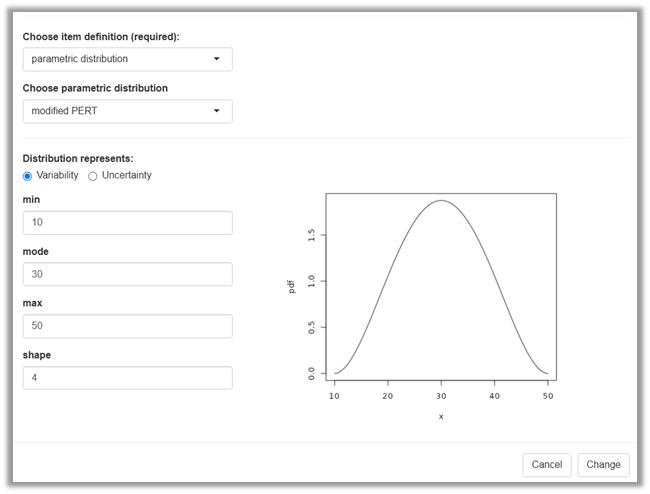

> [!NOTE]
>
> ### Example for a distribution parameter with functional dependency (L.monocytogenes in cheese)
>
> The objective of the <u>L.monocytogenes in cheese</u> model is to
> estimate the risk of infection with Listeria (L.) monocytogenes per
> meal. The model uses the variable dose of ingested L. monocytogenes
> per serving, $D_{dist}$ modelled as Poisson distribution
> (<a href="#fig-functionalPoissonLMono" class="quarto-xref">Figure 10</a>).
> The expression entered as distribution parameter $\lambda$ uses as
> parent nodes the serving size $S$ and the concentration of L.
> monocytogenes in the cheese at home $LMC_{home}$, both of which
> express variability as well. This results in a dispersion of dose
> $D_{dist}$ much wider than what would be expected with a fixed value
> for the distribution parameter $\lambda$.
>
> 

> [!CAUTION]
>
> ### Read more
>
> #### Quick guide for choosing appropriate distributions
>
> Please refers to this compendium of distributions to select the
> apprpriated distributions and distribution parameters: [Compendium of
> Distribution](https://www.vosesoftware.com/knowledgebase/whitepapers/pdf/ebookdistributions.pdf)
>
> @MG \[ we could download the pdf so we will be sure that always it is
> there, in case website changes\]
>
> Some text required here.
>
> #### Defining variability and uncertainty
>
> > “**Variability** reflects the fact that a variable is observed under
> > different conditions. This generally refers to existing differences
> > between individuals, and/or variation in time and space. Variability
> > describes a property of the population. Variability in the
> > population should be described but cannot be reduced. However, the
> > variability in the data used for an assessment can be reduced by
> > applying selection criteria (e. g. excluding individuals with
> > specific traits). Stratification is another approach to reduce
> > variability within the generated strata of the data. Changes over
> > time occur on individual level (repeated observations, individual
> > growth, changed behaviour or traits) as well as population level
> > (population trends). The latter are often considered along with
> > spatial factors. In case of changing exposure conditions of a
> > population – e. g. due to (regional) changes in market supply over
> > time – the variance of influential parameters might change as well.
> > **Uncertainty** reflects the fact that the knowledge required for
> > any step of the estimation process (problem formulation, scenario,
> > model, parameters, calculations) is limited. Parameter uncertainty
> > may be due to measurement errors at the individual level of
> > observation and all sources of bias when selecting and aggregating
> > observations into summary statistics for a given target population.
> > The degree of uncertainty can be reduced on the basis of knowledge,
> > at least in principle.” ([Heinemeyer et al.,
> > 2022](https://mobil.bfr.bund.de/cm/349/guidance-on-uncertainty-analysis-in-exposure-assessment.pdf))
>
> Note that uncertainty does not only apply to the level of a parameter
> (node) but can be related to problem formulation, scenario, model and
> calculations. In shiny rrisk, the user should describe those
> uncertainties in the free-text field of the model description (see
> <u>Alizarin Red S in eel</u> model as an example).
>
> #### Using distributions to reflect variability and uncertainty
>
> A distribution node can be defined by the user to represent the
> variability of a variable of interest, e.g. body weight. One typical
> situation is to parameterise the distribution using a single value for
> each distribution parameter, e.g., a single mean and a single standard
> deviation for the distribution of body weight obtained from observed
> data. The same principle applies for distributions with one parameter
> (e.g., Poisson) or distributions with three parameters as shown in the
> example above using the modPert
> (<a href="#fig-modPert" class="quarto-xref">Figure 9</a>). The
> variability of the quantity of interest is represented by one
> distribution node, which is parameterised with a single value for each
> distribution parameter. This is the standard situation for
> characterising variability (see top row shaded in blue in
> <a href="#fig-Parameterisations" class="quarto-xref">Figure 11</a>).
>
> More complex sources of variability may occur. For example, it may be
> known that a parameter of a distribution node for variability varies
> among sub-groups of the population. Typical examples include the
> litter effect in experimental animal studies or the cluster effect in
> observational studies. In this case the parent node for the
> distribution parameter represents variability at a higher aggregation
> level and “final” distribution node represents overdispersion,
> i.e. variability from various sources. Consider for example a
> Bernoulli distribution (for variability) with a binary outcome space
> (positive/negative), parameterised with a parameter for prevalence. It
> is a common finding in veterinary epidemiology that herd-level
> prevalences have a distribution. In such cases it may be possible to
> characterise the observed distribution of herd-level prevalences using
> a beta distribution and to use this beta as parent node to the
> Bernoulli.
>
> Additional variability may also be due to structural sources. For
> example, the mean value of bacterial load may depend on temperature.
> In this case, the mean of the variability distribution can be modeled
> as a function of temperature. The factor of interest can be continuous
> (e.g., temperature) or discrete (e.g., age groups). In both cases, the
> independent factor is represented as parent node in the model and the
> final variability node represents variability due to structural (or
> functional) sources of variability.
>
> The other motivation for using distributions in risk models is to
> represent parameter uncertainty. Assume you have a binomial
> distribution node in your model to represent variability of the random
> number of positive outcomes out of a fixed number of trials, given a
> defined outcome probability. A beta distribution for the latter would
> represent parameter uncertainty and act as parent node to the binomial
> distribution. The node <u>mean_log10_c0</u> from the <u>E.coli in
> beef</u> example is another illustration for an uncertainty parent
> node to a variability node. The bootstrap method provides a powerful
> solution for obtaining distributions for parameter uncertainty (see
> later). Independent of the technique used,
> the interpretation of the final distribution node is a quantification
> of variability accounting for parameter uncertainty.
>
> Last but not least consider a node in your model that directly
> represents a parameter uncertainty. The classical example for this is
> prevalence. The prevalence is an unknown single value, i.e. only one
> value can be true at the same time. The statistical uncertainty in the
> estimation of prevalence is represented by a beta distribution with
> parameters $k+1$ and $n-k+1$, where $k$ and $n$ denote the number of
> cases and sample size in estimation of prevalence.
> we don’t have a beta in our example models…
> unbelievable;). Since prevalence is a common parameter in may
> risk models, its quantification of uncertainty using a single node is
> a typical situation in risk modelling (bottom row shaded blue in
> <a href="#fig-Parameterisations" class="quarto-xref">Figure 11</a>).
>
> 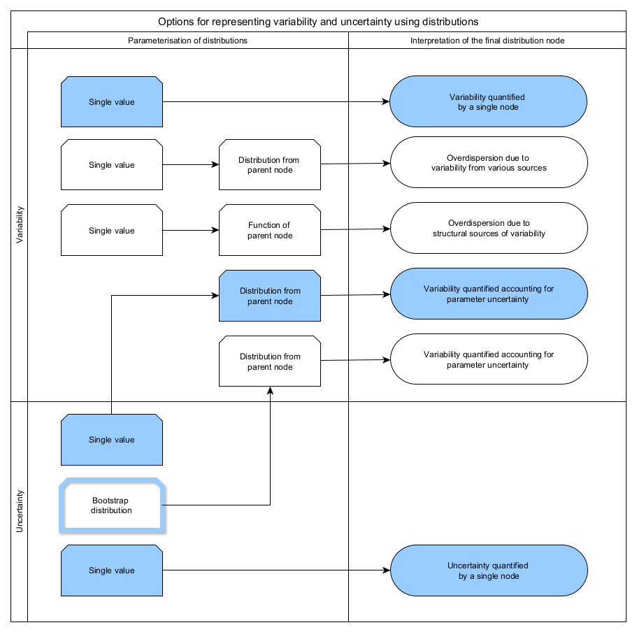
>
> #### Truncation versus censoring
>
> A truncated distribution for reflecting variability accounts for
> plausible lower or upper limits of the underlying quantity. It is
> important to note that “quantity” refers to the substantial phenomenon
> being modelled. For example, the concentration of a chemical in a food
> commodity has a lower truncation point of zero, meaning that values
> below zero are excluded. This should not be confused with censoring.
> In our example, the measurement data of the chemical are typically
> censored due to the limit of detection and limit of quantification.
> The censored distribution of the measurement data is a surrogate for
> the underlying substance concentration. This introduces a bias which
> can be counteracted by estimating the distribution of the unobserved
> concentration data from the censored data set.
>
> A truncated distribution for reflecting parameter uncertainty may be
> useful to ensure that the distribution parameters are within their
> respective boundaries. However, this is typically achieved by choosing
> adequate distribution families (e.g., choosing a beta distribution for
> a prevalence parameter rather than a \[0,1\]-truncated distribution).

> [!CAUTION]
>
> ### About special distributions implemented in shiny rrisk
>
> ### Sigma distribution
>
> The sigma distribution is a stochastic sampling distribution for the
> variance. This random distribution can be used when the variance is
> estimated from the data. The chi-square ($\chi^2$) test allows to
> determine the best estimate and confidence interval for the standard
> deviation of a normally distributed population, when the population
> mean is known, then the sampling variance estimates the population
> variance from a sample of size $n$. The sampling distribution of the
> variance ($SD$) follows a chi-squared distribution:
> $(n-1)*s^2/sigma^2 ~ X^2_{n-1}$. From this relationship, the sample
> variance can be simulated. \[David Vose, Risk Analysis: a quantitative
> guide, 3rd ed., John Wiley & Sons, 2008. This is described in the
> Chapter: Data and Statistics, paragraph 9.1.2 The chi-square test\]
>
> ### The Yule-Furry process (Death only)
>
> The Yule-Furry process is the stochastic model for an exponential
> growth model. \[David Vose, Risk Analysis: a quantitative guide, 3rd
> ed., John Wiley & Sons, 2008. The Yule-Furry process is described in
> the Chapter: Microbial food safety risk assessment, paragraph 21.1.2
> Growth and attenuation models without memory\].

### Bootstrapping

> [!NOTE]
>
> ### This section will introduce you to
>
> - bootstrapping for generating distributions that represent
>   statistical parameter uncertainty without specifying a distribution
>   family.

Using the non-parametric bootstrap algorithm you can generate a
distribution for any summary statistic of a data set. The advantage of
this approach is that you don’t need to make any distributional
assumption about the original data or the uncertainty distribution of
the summary statistic you are interested in.

Non-parametric bootstrapping is available to generate uncertainty
distributions for one or more statistics of a given data set
(<a href="#fig-BootstrapNode1" class="quarto-xref">Figure 12</a>).
Details are illustrated using the example below.

#### Application of bootstrapping

The application of bootstrapping in shiny rrrisk involves three steps.

1.  Defining a bootstrap node, which involves documenting the data
    source and defining node names and corresponding statistics.
2.  Generating a bootstrap distribution node for each statistic
    requested in step 1 (automatically by shiny rrisk).
3.  Using the distribution node(s) generated in step 2 as parent nodes
    in the definition of further nodes.

> [!NOTE]
>
> ### Example for non-parametric bootstrap (Alizarin red S in Eel model)
>
> An exposure model for <u>Alizarin Red S (ARS) in eel</u> has been
> developed to estimate the intake of ARS with consumed eel (see shiny
> rrisk model report for further details). A small (n=14) data set is
> available for individual consumption of eel per kg body weight. The
> task is to characterise the uncertainty of the population mean and
> standard deviation for individual consumption with accounting for the
> small data set and the correlation between the uncertainty
> distributions of mean and standard deviation
> (<a href="#fig-BootstrapNode2" class="quarto-xref">Figure 13</a>).
>
> 
>
> |                                                      |                                                                                                                                                                                       |
> |------------------------------------------------------|---------------------------------------------------------------------------------------------------------------------------------------------------------------------------------------|
> | Open data         | A local csv-data file may be uploaded as source data. The comma-separated data file should use decimal point “.”, must not contain a variable name and consist of only one column. \| |
> | Provided data     | Alternatively, comma-separated source data can be entered manually. Decimal point “.” should be used if required.                                                                     |
> | Node name         | Up to five nodes can be defined which will be automatically generated and contain the joint bootstrap distribution. \|                                                                |
> | Summary statistic | For each node a proper name of the requested statistic is to be provided using R terminology. \|                                                                                      |
>
> The three steps in this example are the following.
>
> 1.  Defining the bootstrapping node <u>X</u>, providing a data source
>     and requesting the two nodes <u>Xmean</u> and <u>Xsd</u> for the
>     mean and standard deviation, respectively
>     (<a href="#fig-BootstrapNode2" class="quarto-xref">Figure 13</a>).
> 2.  Generating two nodes containing the bootstrap distributions
>     <u>Xmean</u> and <u>Xsd</u> (automatically by shiny rrisk).
> 3.  Using the two nodes for defining a new node <u>C</u> for the
>     population variability in consumption of eel per body weight
>     consumed on single meal
>     (<a href="#fig-ARSnodeC" class="quarto-xref">Figure 14</a>).
>
> 

> [!CAUTION]
>
> ### Read more
>
> #### Bootstrapping - how does it work?
>
> Non-parametric bootstrapping (bs) is able to create an uncertainty
> distribution for any single-valued statistic of a data set such as,
> for example, a mean value or a standard deviation without using any
> assumption about the underlying distribution. In shiny rrisk, any
> statistic known to the [software R](https://www.r-project.org/) can be
> requested such as `sum`, `mean`, `median`, `quantile(x, probs=.95)`
> (95th percentile), `var` and `sd` to mention the most relevant ones.
> The bs uses sampling with replacement from the original data, whereby
> the original sample size is maintained and the requested statistic is
> evaluated for each of those bs samples. The bs sampling size is set to
> 2000? in shiny rrisk. The bootstrap
> algorithm is shown in
> <a href="#fig-BootstrapConcep" class="quarto-xref">Figure 15</a>.
>
> 
>
> #### What can be limitations of bootstrapping?
>
> An advantage of non-parametric bootstrapping is that you don’t need to
> make any assumption about the mathematical distribution of the
> original data or the uncertainty distribution of the required
> statistic. The latter emerges from bootstrapping and resembles the
> mathematically “correct” distribution. On the other hand, bs is not
> able to generate information about the population beyond what you have
> in form of the original data. You should not expect to obtain very
> useful information from very small, say $n<5$ data sets. This is
> mainly due to the limited empirical support, even under the so-called
> assumption of independent, identically distributed observations in the
> sample.
>
> A further limitation of non-parametric bootstrap is that distributions
> take a discrete shape for very small size of the original data sample.
> Sampling with replacement of $n$ observations can result in exactly
> $2n-1\choose n-1$ possible permutations of sampling $n$ out of $n$.
> The table below shows that more than 5 observations are needed to
> obtain only 126 permutations can occur. If the original data set
> contains outlier values, the discreteness can present a further
> limitation.
>
> |                                                   |     |     |     |     |      |      |       |       |
> |---------------------------------------------------|-----|-----|-----|-----|------|------|-------|-------|
> | Size of original data ($n$)                       | 3   | 4   | 5   | 6   | 7    | 8    | 9     | 10    |
> | Number of possible permutations $2n-1\choose n-1$ | 10  | 35  | 126 | 462 | 1716 | 6435 | 24310 | 92378 |

### rrisk distributions import

> [!NOTE]
>
> ### This section will introduce you to
>
> - importing the mathematical definition of a distribution generated
>   using rrisk distributions.

Let’s assume that you have used the “rrisk distribution” app for
defining a distribution based on observed sample data or percentiles
(see tutorial for more information). You need to upload the fitting
result for use in your shiny rrisk session.

After import of the rrisk distribution export file, the created node is
completely defined.

## Node Table

After nodes are created, the following table will be created in shiny
rrisk the information of each node in the model.

The table contains the node ID, a sequence number according to the order
a node was created during the the model creation. The rest of the
columns present the information of each node that was entered during the
node creation.

The table allows the user to sort each column separately, delete a node
and search for particular terms. This later is very helpful when working
with large models.

## Graph

As soon as a node is created, a shape (square, circle or star) with a
given color will appear in the screen. The star is the node representing
the outcome(s), or the node that has no dependent nodes (or “child”
nodes).

@MG/RO \[ - define Circle represents and squares - Is there any
standards?\]

There are two check boxes the user can choose to change the layout of
the graph created by shiny rrisk.

The user can leave unchecked the option “stretch model graph” so all the
shapes can be moved freely by clicking with the mouse on a node.
Otherwise by selecting “stretch model graph” all the shapes will be
automatically organized with the”outcome” node located at the far right.
If this option is selected, the user can only move the shapes up and
down. This feature will help organizing very quickly the model’s graph
and improve the visualization, especially for models with large number
of nodes.

The next figure depicts the same model but with stretch model graph
checked

The other check box is “collapse groups”. If checked, all the nodes
identified with the same “group name” will be hidden under the node
identified with that group name. This is very useful when presenting a
model with many nodes.

The user can click the mouse in any place on the screen that occupies
the graph in order to move the whole graph, also the user can zoom
in/zoom out using the appropriated combination of keys according to
operating system (eg. Windows or MAC) or using the mouse. The user can
double click on a node to open the node definition window (explained
above).

In order to move down to the definition table, the user should move the
mouse out of the graph window or use the siding bar on the screen.

## Check Model

Once all the nodes have been properly defined, the user should select
Check Model for model verification. The model verification features
assures that all the nodes are linked and properly defined. An error
will appear other wise. The user will need to check that there is no
isolated nodes (which could be due to typo in the node’s names and/or an
invalid equation)

## Fixed parameters and functions

Shiny rrisk allows users to develop their owns functions and parameters
to be used in several nodes in the model. These features are considered
advanced and requires some understanding of shiny mathematical
architecture \[@Robert – needs some input\] as well as knowledge in R
programming.

A function is a predefined set of commands and mathematical calculations
where a variable can be plugged into to generate the results. A common
function in exposure models is for instance the use of microbial growth
models where the variable temperature can be used for different
conditions.

> [!NOTE]
>
> ### Example: Function from Yersinia enterocolitica model
>
> The function below is taken from the case model \*Yersinia
> enterocolitica\* in minced meat in shiny. The function below will
> allow bacteria to grow pending on different temperatures (C)
>
> Under Fixed Parameters and Functions in shiny rrisk, the user should
> select **Add new parameter or function,** and enter the text below in
> the window under Description.
>
> function(Temp)
>
> {
>
>     a \<- 0.0242  \# 1/h; growth rate at Temp = 0°C
>
>     Tref \<- 7.092  \# °C; if Temp = Tref, then growth_rate = a \*
> exp(1)
>
>     a \* exp(Temp/Tref)
>
> }
>
> The function should start with the word “function”. Then the word in
> brackets after the word function represents variable to be used in the
> equations. This word will be used in different parts in the equations
> between the curling brackets. The function just needs a word there
> that will be replaced by the user defined variable in the model.
>
> The node below describes the use of the function in the Yersinia model
>
>  style="border: 2px solid black;  box-shadow: 4px 4px 12px rgba(0, 0, 0, 0.6);"
> width="500" />

# Running a simulation

> [!NOTE]
>
> ### This section will introduce you to
>
> - setting simulation parameters to enhance the efficiency  
> - obtaining model result interface
> - interpreting model results
> - Interpreting sensitivity analysis

Start the simulation to change the default simulation settings and get
the results of your model.

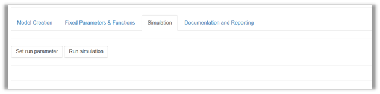

## Simulation settings

Before running the simulation, you may **set run parameters** to control
the default settings of the simulation. This can be useful to increase
the efficiency of the simulation. Depending on whether your model
involves a one-dimensional (1D) or two-dimensional (2D) simulation, the
number of replicates is given in general or separately for variability
and uncertainty
(<a href="#fig-setrunparameter" class="quarto-xref">Figure 18</a>).

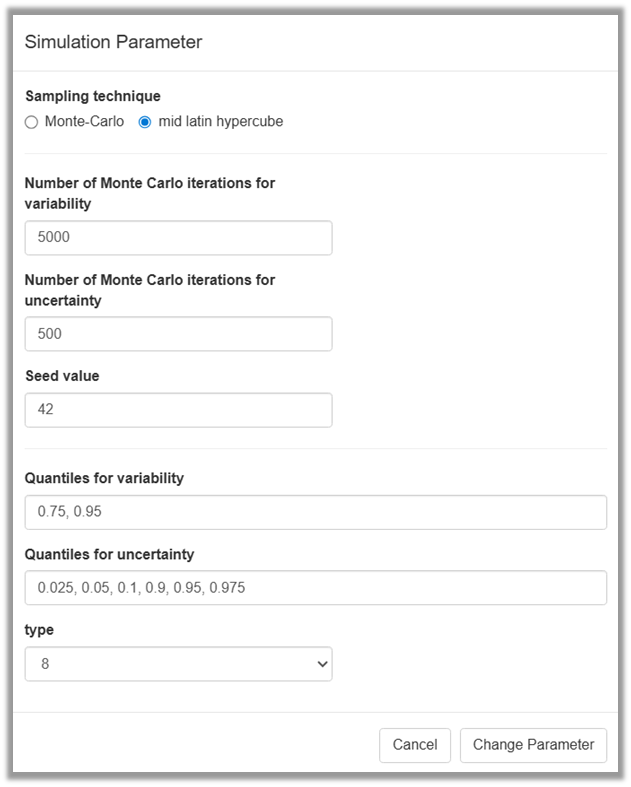

|                                                                                                          |                                                                                                                                  |
|----------------------------------------------------------------------------------------------------------|----------------------------------------------------------------------------------------------------------------------------------|
| Sampling technique                                                    | Choose between Monte-Carlo (default) and latin hypercube (enhanced efficiency)                                                   |
| Number of replicates\*                 | Enter the number of random samples for all distribution nodes (1D model)                                                         |
| Number of replicates\* for variability | Enter the number of random samples for nodes reflecting variability (2D model)                                                   |
| Number of replicates\* for uncertainty | Enter the number of random samples for nodes reflecting uncertainty (2D model)                                                   |
| Seed value                                                            | Enter an integer number, which will allow to reproduce the random sampling results                                               |
| Type                                                                  | Select quantile algorithm for calculating the percentiles                                                                        |
| \*                                                                        | “Monte Carlo iterations” will be replaced with “replicates” since this applies to both Monte Carlo and latin hypercube sampling. |

The setting of the **Sampling technique**, Monte Carlo (MC) versus mid
latin hypercube (LH), is a technicality that can be ignored unless you
have a specific preference (read more about sampling method below).

The **Number of replicates** allows you to to set the sample size for
the simulation that is adequate for the modelling task (read more about
number of replicates below).

Documentation of the **Seed value** allows you to exactly reproduce the
numerical results of your model. This is possible because the random
number generation uses a fully deterministic process. However, for
practical purposes, the numbers generated using both the MC and LH
algorithms can be assumed to be random, independent and identically
distributed. The term “random” sample will be used for both MC and LH
sampling techniques.

The default setting of the **Type** for calculating percentiles follows
the recommendation given by the developers of R’s “quantile” function
(see
[documentation](https://www.rdocumentation.org/packages/stats/versions/3.6.2/topics/quantile)),
which is part of the R “stats” package (R Core Team, 2024. R: A Language
and Environment for Statistical Computing. R Foundation for Statistical
Computing, Vienna, Austria. <https://www.R-project.org/>).

> [!WARNING]
>
> ### Memory
>
> The shiny rrisk server allocates a fixed size of memory to run the
> simulation. The amount of memory used is influenced by the number of
> nodes and the number of samples requested in the variability and
> uncertainty dimensions.

> [!TIP]
>
> ### Good practice - Number of replicates
>
> Since the number of nodes is given by the structure of the model, the
> amount of memory used will mainly depend on the number of random
> samples. Usually, the number of samples is selected based on standard
> “magic” numbers, like 100, 1000, 10000, etc. However, there are some
> approaches that can be followed as a guidance to estimate an
> approximate number. For the first approach you need the probability of
> the event being modelled as outcome (which is typically low in risk
> and exposure assessments) and the minimum expected **number of events
> you wish to model** to obtain a statistically meaningful result. Let
> $p$ denote the (low) true risk and $n$ the minimum expected number of
> occurrences of the event you wish to model. You can approximate the
> required number of replicates $N$ using
>
> $$N\ge n/p.$$
>
> For example, to observe at least $n=5$ events with a
> $p = 1/10000=10^{-4}$, you will need $N\ge=5*10^4$, at least 50,0000
> samples. Finding the appropriate number of samples is an iterative
> process, where different simulations are run until consistent values
> for up to two/three digits of the mean or median are obtained. The
> second and more general approach for assessing the required number of
> replicates uses the **convergence plot** (see below).

> [!TIP]
>
> ### Good practice - Choice of percentiles for numerical results
>
> The median as a measure of central tendency and 95th percentile for
> characterizing the spread towards more extreme outcomes are usually
> reported to characterize the variability of the outcome in exposure or
> risk models. If a 2D simulation has been conducted to account for
> parameter uncertainty, these outcome statistics are usually reported
> with a 95% uncertainty interval, i.e. an interval ranging from the
> 2.5th to the 97.5th percentile of the uncertainty distribution. If
> this interval is too wide to convey useful information, more narrow
> symmetrical intervals such as 10th and 90th percentile may be
> appropriate.

> [!CAUTION]
>
> ### Read more - Monte Carlo (MC) vs. latin hypercube (LH) sampling
>
> Two sampling methods can be used in shiny rrisk. The Latin Hypercube
> (LH) method is more efficient and will provide the same accuracy as
> the Monte Carlo (MC) method with fewer samples. In addition the LH
> will assure that samples are taken from the whole distribution, which
> is also better for rare events. The LH might reduce the number of
> samples required by a factor of 10 compared with the MC method. The LH
> is the default method in shiny rrisk.
>
> The LH method divides each random variable’s range into equal
> probability intervals (strata) according the number of samples
> required in the simulation and then take one sample from each interval
> per variable. Then the full coverage of each variable is sampled.
>
> <a href="#fig-mc_lh_v2" class="quarto-xref">Figure 19</a> shows two
> input parameters of the simple risk model $\mbox{Risk}=X_1*X_2$. Note
> that even with a small number of 80 sampling replicates, LH sampling
> results in a more homogeneous coverage of the sampling space as
> compared to the MC method.
>
> 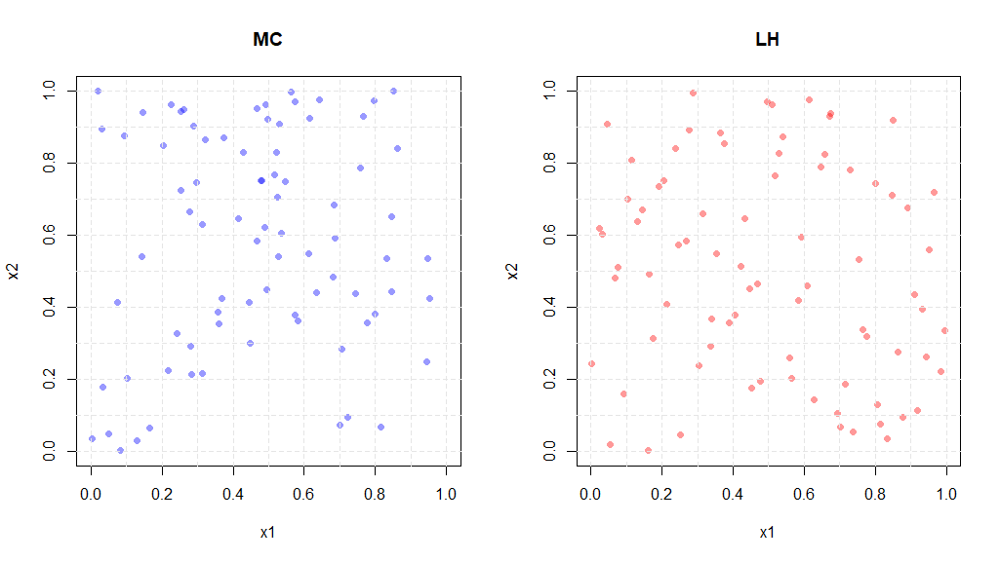
>
> The table below compare the sampling methods to the true risk after
> taken 80 samples for the two input variables. The risk estimated using
> LH sampling is more accurate than the MC estimate.
>
> |        Method        | Sample Size | Mean Risk | S.E.  |
> |:--------------------:|:-----------:|:---------:|:-----:|
> |         True         |     —-      |   0.017   |  \-   |
> |   Monte Carlo (MC)   |     80      |   0.038   | 0.021 |
> | Latin Hypercube (LH) |     80      |   0.013   | 0.012 |

## Run simulation

After setting all the parameters, select **Run Simulation.** After the
simulation is completed, shiny rrisk will present **general results**
and **sensitivity plot.**

### General results

Under **general results** you can access the numerical as well as the
graphical results of your model. The end node (final outcome of your
model) is shown by default. The results of any other node can be shown
by selecting the **Node** from the drop-down menu.

#### One-dimensional (1D) simulation

Shiny rrisk conducts a one-dimensional (1D) simulation, if none of the
distribution nodes is defined to represent uncertainty. In this case,
the numerical outcome consists of only one row of results, the **mean**,
**median**, standard deviation (**sd**), a selection of **percentiles**
(see Simulation settings) as well as the **unit**. This is shown using
the *Yersinia enterocolitica* in minced meat model as example. The
median and 95th percentile of the outcome (N_cg) is 0 and 89 colony
forming units (CFU), respectively
(<a href="#fig-general_results_out_1D" class="quarto-xref">Figure 20</a>).

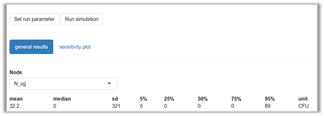

#### Two-dimensional (2D) simulation

Shiny rrisk conducts a two-dimensional (2D) simulation, if at least one
of the distribution nodes is defined to represent uncertainty. In this
case, the numerical outcome consists of columns as defined for 1D models
(see above) and rows for the **mean**, **median**, standard deviation
(**sd**), a selection of **percentiles** for the uncertainty dimension
(see Simulation settings). This is shown using the *E. coli* in beef
patties model as example. The 90% uncertainty interval for median and
95th percentile for the outcome (risk) is 0.003-0.087 and 0.442-1.0,
respectively
(<a href="#fig-general_results_out_2D" class="quarto-xref">Figure 21</a>).

> [!CAUTION]
>
> ### Read more - Interpretation of percentiles
>
> Percentiles of the outcome function evaluated using shiny rrisk can be
> regarded as unbiased in a statistical sense. This property of
> probabilistic modelling is advantageous in comparison to a
> deterministic approach that would give you a biased result under
> general conditions.
>
> Assume you were interested in the high, say 95th percentile of the
> outcome distribution. This is typically the case to account for the
> high end of the range of outcomes consistent with the information
> captured in the model. Using a **deterministic approach**, you would
> use the “high risk percentiles” for each of the input variables.
> Multiplying the 95th percentiles of two random variables results in a
> larger value compared to the 95th percentile of the simulated product
> if the two factors are uncorrelated. Thus, the deterministic approach
> for evaluating high percentiles is biased towards high risk outcome.
>
> This effect is demonstrated using illustrative distributions
> representing variability in food consumption (FC) and substance
> concentration (SC). The product of the 95th percentiles is an
> overestimation of the 95th percentile of the exposure Ex=FC\*SC
> (<a href="#fig-BiasedP95" class="quarto-xref">Figure 22</a>).
>
> 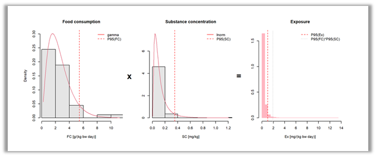

### Graphical results

Under **general results** you can also access the graphical results of
your model. The end node (final outcome of your model) is shown by
default. As for the numerical results, any any other node can be shown
by selecting the **Node** from the drop-down menu.

#### Histogramme

The histogramme depicts the density distribution of the random values
for the given node. There is no principal difference in appearance and
interpretation of a histogramme between 1D and 2D models and between end
nodes (outcome of the model) and any other distribution node
(<a href="#fig-histogramme" class="quarto-xref">Figure 23</a>). The
histogramme may reveal a non-homegeneous distribution of the outcome,
which can be due to the effect of some discrete parameters in the model
(see 2D example below).

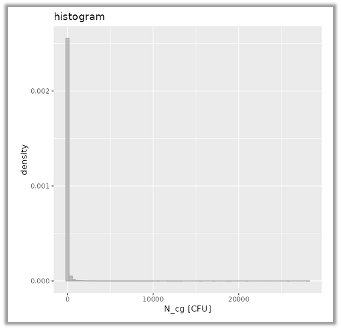

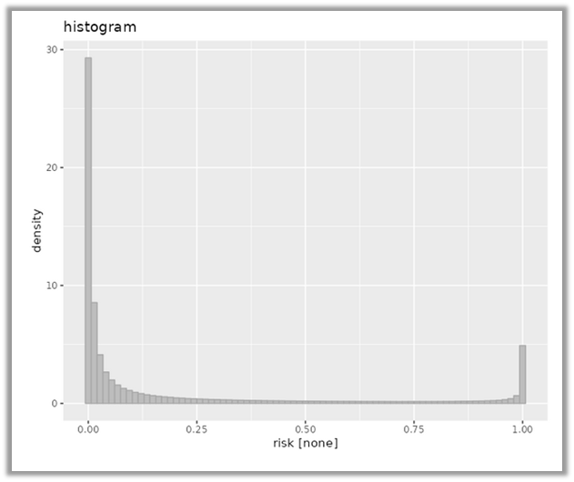

#### ECDF plot

The empirical cumulative density function (ECDF) is a line plot
connecting the empirical quantiles of the distribution (x-axis) plotted
against the cumulative probability (y-axis). This feature allows that an
uncertainty envelope is added in case of a 2D model. Thus, there is an
important difference in appearance and interpretation of the ECDF plot
between 1D and 2D models. Whereas uncertainty is not quantified in a 1D
model, the uncertainty envelope (50% and 75% shown be default)
visualizes the uncertainty at each cumulative probability for a 2D model
(<a href="#fig-ecdf" class="quarto-xref">Figure 24</a>, see below for
further details).

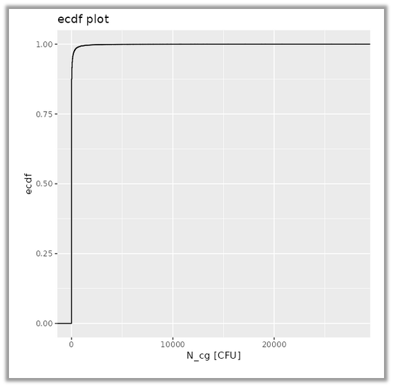

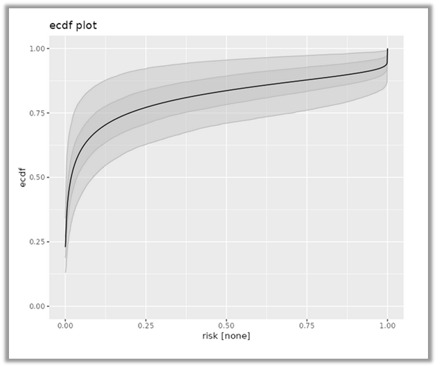

> [!CAUTION]
>
> ### Read more - Interpretation of 2D simulation plot
>
> The ECDF plot for a 2D model depicts the outcome of the model in terms
> of both variability and uncertainty. The process of 2D modelling
> involves a repeated evaluation of the model whereby for each
> repetition single values are picked at random from the distributions
> representing uncertainty. This yields a large number of ECDF plots for
> variability which jointly visualize the effect of parameter
> uncertainty on the final outcome distribution
> (<a href="#fig-eufora-2D" class="quarto-xref">Figure 25</a>).
>
> 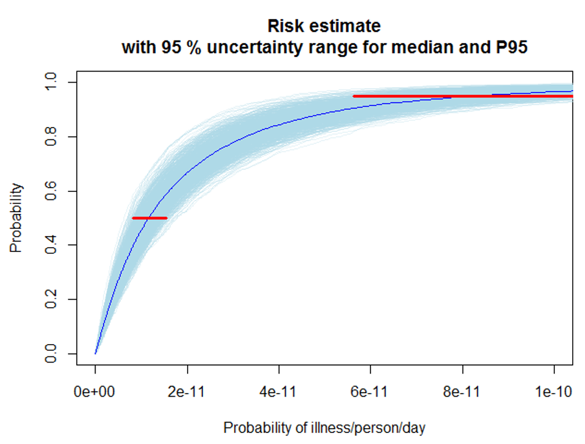
>
> The central tendency (median) of the risk estimate can be read from
> the intersection of the dark blue line with the red line parallel to
> the x-axis at a probability value of 0.5 (x-axis). The value is around
> 1e-11.
>
> The 95th percentile (P95) provides an estimate of the risk that
> captures 95% of the variability of the input parameters. It can be
> read from the x-axis where the upper red line intersects with the dark
> blue line. The value is around 1e-11.
>
> The uncertainty of the median and 95th can be read from range of
> x-values across the red lines for the two statistics. The uncertainty
> ranges are defined such that 95% (or another uncertainty interval) of
> the individual ECDF plots are covered at the given probability level.
>
> The shiny rrisk version of the ECDF plot for 2D models connects all
> such uncertainty ranges resulting in an uncertainty envelope (see
> <a href="#fig-ecdf" class="quarto-xref">Figure 24</a>, right panel).
> Note that ECDF plot are for visualization only. Numerical values
> should be read from the result table.

#### Convergence plot

The convergence plot displays the numerical result of your model as a
function of the cumulative number of replicates. Thus, it is a visual
aid to access whether convergence has been reached, i.e. a state where
no more changes in outcomes are seen when adding more replicates. While
a lot of random fluctuation is seen with low numbers of replicates, the
outcome tends to become more stable with an increasing cumulative number
(<a href="#fig-convergence" class="quarto-xref">Figure 26</a>). Final
inference should be made only on the basis of models that have
converged.

> [!CAUTION]
>
> ### Read more - Convergence
>
> Generally, it may take more replicates for a 2D to converge compared
> to a 1D model. However, convergence also depends on the number of
> distribution nodes and their respective shapes. Convergence may be
> improved by selecting latin hypercube sampling instead of Monte Carlo
> sampling
> (<a href="#fig-convergence-sampling" class="quarto-xref">Figure 27</a>).
>
> 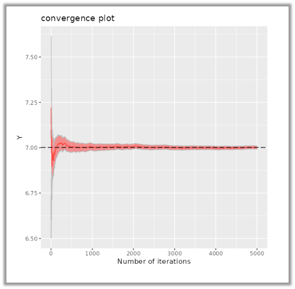 alt="Monte Carlo (MC) simulation (Alizarin red S in Eel model)" />
>
>  alt="Latin hypercube (LH) simulation (Alizarin red S in Eel model)" />

#### Sensitivity Plot

The sensitivity analysis in shiny rrisk explores the effect of model
input variables (distribution nodes) on the model outcome. The results
can be visualized by selecting the **sensitivity plot** tab in the main
screen after running the simulation
(<a href="#fig-sens_analysis-01" class="quarto-xref">Figure 28</a>).

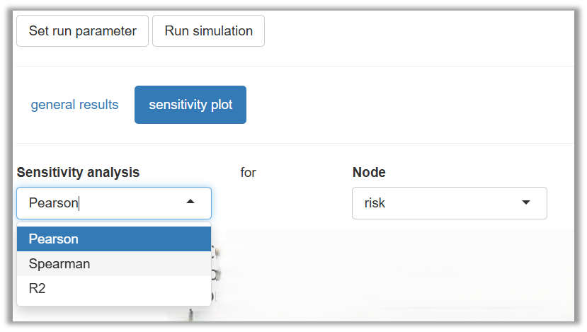

|                                             |                                                                                                      |
|---------------------------------------------|------------------------------------------------------------------------------------------------------|
| Pearson  | Correlation between model input and output quantified using Pearson product-moment correlation.      |
| Spearman | Correlation between model input and output quantified using Spearman’s rank correlation coefficient. |
| R2       | Correlation between model input and output quantified using r-squared (not yet implemented).         |

The correlation statistics are visualised as a vertical bar chart,
whereby the bars are sorted from high to low, which is commonly referred
to as a **tornado plot**. In case of 2d models, the statistics are
presented with 95% uncertainty intervals.

The tornado plots below use the Pearson statistic for quantifying the
sensitivity for two models
(<a href="#fig-sensitivity-comparsion" class="quarto-xref">Figure 29</a>).
The plot for the 1D model (*Yersinia enterocolitica* in minced meat)
reveals that five distributions have a weak positive correlation, the
number of *Y. enterocolitica* in one package of minced meat after
storage at retail (N_rg) being the most influential one. The plot for
the 2D model (*E. coli* in beef patties) shows that the distribution of
the initial concentration based on 18 fictitious counts of *E. coli*
O157:H7 (log10_C0) has a moderate positive correlation with the model
outcome. Since this is a 2D model, the tornado plot also presents 95%
uncertainty ranges. Thus, the impact of log10_CO in the model outcome is
significantly higher compared to the reduction factor, also when
accounting for parameter uncertainty (uncertainty intervals are not
overlapping).

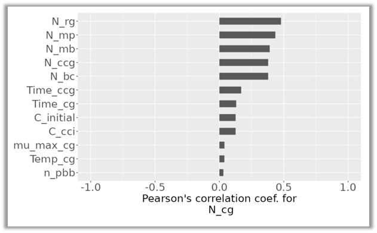

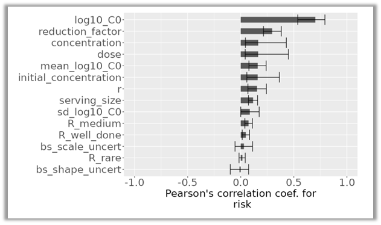

> [!CAUTION]
>
> ### Read more: Tornado plots
>
> Tornado plots are commonly used in risk and exposure assessments
> models to assess the quantify the impact of input variables on the
> outcome of the model. This relationship is quantified using parametric
> (e.g. Pearson correlation coefficient) or non-parametric
> (e.g. Spearman rank correlation coefficient - rho -) statistics.
>
> The graphs is created using all the input variables on the y-axis and
> the statistic on the x-axis, then the relationship is depicted using
> horizontal bars where the length of the bar represents the value of
> the statistic. This value is constraint by the boundaries of the
> statistic (e.g. between -1 and 1). Where values below 0 represent an
> inverse relationship and values greater than 0, otherwise. For
> instance negative values suggest that higher values of the input are
> associates with lower values of the outcome variable.
>
> In addition, for 2D models, each input variable has a line indicating
> the 95% probability interval of the relationship due to the
> uncertainty propagated in the model.
>
> **Pearson correlation coefficient**. The relationship is captured
> assuming a linear relationship between the input variable and the
> outcome using the Pearson correlation coefficient.
>
> **Spearman rank correlation**. The relationship is captured using the
> non-parametric rank correlation which does not assume any particulate
> shape of the relationship between the input and outcome.
>
> This graphs are called “tornado” because the shape of the graphs
> resembles a “tornado”, funnel like shape since the variables are
> sorted from highest values on the top to the lowest at the bottom.

# Documenting and reporting

> [!NOTE]
>
> ### This section will introduce you to
>
> - using shiny rrisk’s interface for a general model description,
> - structuring your description using simple markdown syntax,
> - adjusting the level of documentation to specific requirements
> - launching the automatic reporting function and
> - embedding the reporting into the reviewing-editing-updating
>   workflow.

## Adding general model description

A comprehensive documentation of a model requires some descriptions at
the level of the model. This part of documentation is optional but
highly recommended
(<a href="#fig-Documentation" class="quarto-xref">Figure 30</a>).

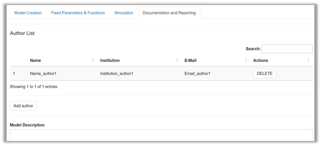

Under **Author list** you can disclose who assumes the scientific
responsibility for the work. Future versions of shiny rrisk will allow
you to indicate the corresponding author.

Under **Model description** you will find one free-text field for all
the general descriptions of the model. In the absence of a generally
accepted standard structure for this purpose you have the flexibility to
generate a structure that meets your specific reporting needs. Below are
some best practice recommendations for your consideration. A simple
markdown syntax can be used to structure the description into sections
and subsections. Markdown syntax can also be used to generate some
standard text formatting (see below).

> [!TIP]
>
> ### Good practice - Generic structure for model description
>
> The suggested first-level headers below can be pasted into the
> free-text field for **Model description**. The symbol \`#’ at the
> beginning of text lines ensures that the rendered model report uses
> the format for first order headers. Use whatever meets your reporting
> requirements and delete what is not needed. See the Alizarin red in
> eel model for a more elaborated model description. Future versions of
> shiny rrisk may offer a default structure which can be adapted as
> needed.
>
> **\# Preamble**
>
> This section may provide an editorial introduction. Since a model is
> often an annex to some main report, a link to the main document can be
> given here.
>
> **\# Abbreviations**
>
> A list of abbreviations used in the documentation may useful.
>
> **\# Background**
>
> The motivation for the work and a summary of current scientific
> knowledge may be provided here.
>
> **\# Objectives**
>
> It is highly recommended to formulate the objectives of the specific
> modelling task.
>
> **\# Scope**
>
> This section states aspects of the model that are explicitly included
> or excluded. Such aspects may pertain to the hazard identification or
> the scenario (e.g., exposure and risk pathways, populations and risk
> factors).
>
> **\# Model description**
>
> This section contains a summary description of the model. Parts or
> modules of the model, when used in the definition of nodes, can be
> described separately using sub-sections, marked with \`##’.
>
> **\# Uncertainty assessment**
>
> We recommend that major sources of uncertainty are documented as
> described by [Heinemeyer et
> al. (2022)](https://www.bfr.bund.de/cm/349/guidance-on-uncertainty-analysis-in-exposure-assessment.pdf).
> The Alizarin red S in Eel model provides an example for specifying
> uncertainties pertaining to the scenario (agents, sources,
> populations, microenvironment, time, activities, pathways, space),
> modelling approach (concept, structure, dependencies, outcome) and
> other sources (question formulation, context, protection perspective,
> population group, protection goal, protection level, scope).
>
> **\# Results **
>
> This section may be used to summarise the main results of the model.
> Reference should be made to **tables** and **graphs** which are
> automatically embedded in the reporting document. It is recommended to
> describe the outcome of the model (end node) using **median** and
> appropriate upper **percentile**. The **uncertainty intervals** should
> be stated when a 2D model has been used. The results of the
> **sensitivity analysis** should be interpreted.
>
> **\# Conclusions**
>
> This section may be used to formulate the conclusions from the model.
>
> **\# Acknowledgement **
>
> Contributions should be acknowledged.
>
> **\# References**
>
> This section may contain a list of references.

> [!CAUTION]
>
> ### Read more - Markdown syntax
>
> Markdown syntax is recommended for structuring the free-text fields
> with headers and subheaders and for other text formatting. The
> Alizarin red S in Eel model provides an example of markdown in the
> description of the model and model parameters (e.g., bootstrapping). A
> selection of common markdown commands available in free-text fields in
> shiny rrisk is given below. You can find more information at [RStudio,
> 2016](https://rmarkdown.rstudio.com/authoring_basics.html) .
>
> | Markdown in free-text field         | Formatted result               |
> |-------------------------------------|--------------------------------|
> | \# Header level 1                   | According to style template    |
> | \## Header level 2                  | According to style template    |
> | \### Header level 3                 | According to style template    |
> | \*italics\*, \*\*bold\*\*           | *italics*, **bold**            |
> | superscript\$^2\$, subscript\$\_2\$ | superscript$^2$, subscript$_2$ |
> | mathematical notation \$Y=f(x)\$    | mathematical notation $Y=f(x)$ |
> | in\[Reference\](URL or DOI)         | <u>Reference</u> with link     |
> | \`verbatim code\`                   | `verbatim code`                |

## Automatic reporting

Shiny rrisk has the unique feature to produce reports that can
facilitate the communication of the model to interested parties. The key
concept is the **integrated model documentation**. You have noted the
pre-structured documentation for each node and the flexiblity to add
documentation at the level of the model (see above). Now it is time to
earn the benefit from this investment of time and effort
(<a href="#fig-reporting" class="quarto-xref">Figure 31</a>).

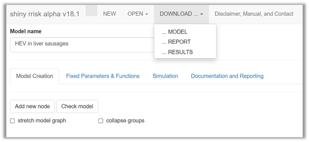

Whereas downloading the **MODEL** is essential to save your entire model
and downloading **RESULTS** gives you easy access to numerical model
results (not yet implemented), the option **REPORT** will launch the
automatic reporting. This function will compile all your model
definitions along with the model results. The model report is also a
practical tool for reviewing and editing of the model definitions (see
below).

> [!TIP]
>
> ### Good practice - Using the reporting function for review and editing
>
> We recommend using the model report for reviewing and editing during
> the model creation process. Updated descriptions can be generated
> using spell-checker, tracked changes or other utilities available in
> your word processing software. The updated text then has to be pasted
> back into the respective free-text fields in your shiny rrisk session.
> After saving the updated model, a new model report can be generated as
> basis for the next revision.

<!-- workflow for adding screenshots
  1. go to the app and adjust browser window size to fit the tutorial layout
  2. use any screenshot tool and paste the results into MS word
  3. add shadow offset centre, 60%, 102%, 5pt, 0, 0pt 
  4. save as .png in image folder
  &#10;  
  Update GitHub token:
  Generate token via GitHub page
  in R: 
  ibrary(gitcreds)
  gitcreds_set()
  &#10;  -->
