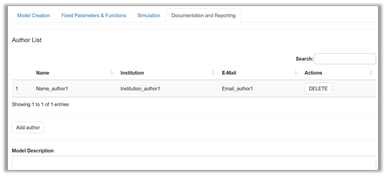
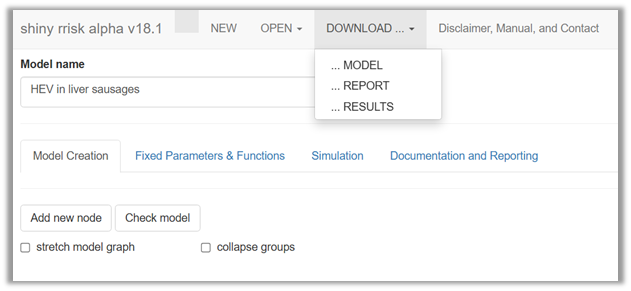

# Documenting and reporting

> [!NOTE]
>
> ### This section will introduce you to
>
> - using shiny rrisk’s interface for a general model description,
> - structuring your description using simple markdown syntax,
> - adjusting the level of documentation to specific requirements
> - launching the automatic reporting function and
> - embedding the reporting into the reviewing-editing-updating
>   workflow.

## Adding general model description

A comprehensive documentation of a model requires some descriptions at
the level of the model. This part of documentation is optional but
highly recommended
(<a href="#fig-Documentation" class="quarto-xref">Figure 30</a>).

Under **Author list** you can disclose who assumes the scientific
responsibility for the work. Future versions of shiny rrisk will allow
you to indicate the corresponding author.

Under **Model description** you will find one free-text field for all
the general descriptions of the model. In the absence of a generally
accepted standard structure for this purpose you have the flexibility to
generate a structure that meets your specific reporting needs. Below are
some best practice recommendations for your consideration. A simple
markdown syntax can be used to structure the description into sections
and subsections. Markdown syntax can also be used to generate some
standard text formatting (see below).

> [!TIP]
>
> ### Good practice - Generic structure for model description
>
> The suggested first-level headers below can be pasted into the
> free-text field for **Model description**. The symbol \`#’ at the
> beginning of text lines ensures that the rendered model report uses
> the format for first order headers. Use whatever meets your reporting
> requirements and delete what is not needed. See the Alizarin red in
> eel model for a more elaborated model description. Future versions of
> shiny rrisk may offer a default structure which can be adapted as
> needed.
>
> **\# Preamble**
>
> This section may provide an editorial introduction. Since a model is
> often an annex to some main report, a link to the main document can be
> given here.
>
> **\# Abbreviations**
>
> A list of abbreviations used in the documentation may useful.
>
> **\# Background**
>
> The motivation for the work and a summary of current scientific
> knowledge may be provided here.
>
> **\# Objectives**
>
> It is highly recommended to formulate the objectives of the specific
> modelling task.
>
> **\# Scope**
>
> This section states aspects of the model that are explicitly included
> or excluded. Such aspects may pertain to the hazard identification or
> the scenario (e.g., exposure and risk pathways, populations and risk
> factors).
>
> **\# Model description**
>
> This section contains a summary description of the model. Parts or
> modules of the model, when used in the definition of nodes, can be
> described separately using sub-sections, marked with \`##’.
>
> **\# Uncertainty assessment**
>
> We recommend that major sources of uncertainty are documented as
> described by [Heinemeyer et
> al. (2022)](https://www.bfr.bund.de/cm/349/guidance-on-uncertainty-analysis-in-exposure-assessment.pdf).
> The Alizarin red S in Eel model provides an example for specifying
> uncertainties pertaining to the scenario (agents, sources,
> populations, microenvironment, time, activities, pathways, space),
> modelling approach (concept, structure, dependencies, outcome) and
> other sources (question formulation, context, protection perspective,
> population group, protection goal, protection level, scope).
>
> **\# Results **
>
> This section may be used to summarise the main results of the model.
> Reference should be made to **tables** and **graphs** which are
> automatically embedded in the reporting document. It is recommended to
> describe the outcome of the model (end node) using **median** and
> appropriate upper **percentile**. The **uncertainty intervals** should
> be stated when a 2D model has been used. The results of the
> **sensitivity analysis** should be interpreted.
>
> **\# Conclusions**
>
> This section may be used to formulate the conclusions from the model.
>
> **\# Acknowledgement **
>
> Contributions should be acknowledged.
>
> **\# References**
>
> This section may contain a list of references.

> [!CAUTION]
>
> ### Read more - Markdown syntax
>
> Markdown syntax is recommended for structuring the free-text fields
> with headers and subheaders and for other text formatting. The
> Alizarin red S in Eel model provides an example of markdown in the
> description of the model and model parameters (e.g., bootstrapping). A
> selection of common markdown commands available in free-text fields in
> shiny rrisk is given below. You can find more information at [RStudio,
> 2016](https://rmarkdown.rstudio.com/authoring_basics.html) .
>
> | Markdown in free-text field         | Formatted result               |
> |-------------------------------------|--------------------------------|
> | \# Header level 1                   | According to style template    |
> | \## Header level 2                  | According to style template    |
> | \### Header level 3                 | According to style template    |
> | \*italics\*, \*\*bold\*\*           | *italics*, **bold**            |
> | superscript\$^2\$, subscript\$\_2\$ | superscript$^2$, subscript$_2$ |
> | mathematical notation \$Y=f(x)\$    | mathematical notation $Y=f(x)$ |
> | in\[Reference\](URL or DOI)         | <u>Reference</u> with link     |
> | \`verbatim code\`                   | `verbatim code`                |

## Automatic reporting

Shiny rrisk has the unique feature to produce reports that can
facilitate the communication of the model to interested parties. The key
concept is the **integrated model documentation**. You have noted the
pre-structured documentation for each node and the flexiblity to add
documentation at the level of the model (see above). Now it is time to
earn the benefit from this investment of time and effort
(<a href="#fig-reporting" class="quarto-xref">Figure 31</a>).

Whereas downloading the **MODEL** is essential to save your entire model
and downloading **RESULTS** gives you easy access to numerical model
results (not yet implemented), the option **REPORT** will launch the
automatic reporting. This function will compile all your model
definitions along with the model results. The model report is also a
practical tool for reviewing and editing of the model definitions (see
below).

> [!TIP]
>
> ### Good practice - Using the reporting function for review and editing
>
> We recommend using the model report for reviewing and editing during
> the model creation process. Updated descriptions can be generated
> using spell-checker, tracked changes or other utilities available in
> your word processing software. The updated text then has to be pasted
> back into the respective free-text fields in your shiny rrisk session.
> After saving the updated model, a new model report can be generated as
> basis for the next revision.

<!-- workflow for adding screenshots
  1. go to the app and adjust browser window size to fit the tutorial layout
  2. use any screenshot tool and paste the results into MS word
  3. add shadow offset centre, 60%, 102%, 5pt, 0, 0pt 
  4. save as .png in image folder
  &#10;  
  Update GitHub token:
  Generate token via GitHub page
  in R: 
  ibrary(gitcreds)
  gitcreds_set()
  &#10;  -->
