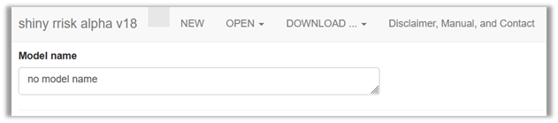
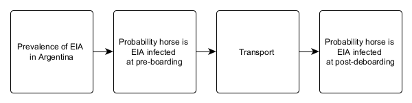

# Shiny rrisk user guide
Matthias Greiner, German Federal Institute for Risk Assssment (BfR) and
Veterinary University Hannover, Germany, Javier Sanchez. University of
Prince Edwards Island (UPEI), Canada

# Getting started

> [!NOTE]
>
> ### This section will introduce you to
>
> - getting started with a shiny rrisk session and
> - managing the data file that contains the complete documentation and
>   executable code of your model.

The app shiny rrisk has been designed to support you in setting up,
running and reporting a probabilistic risk model. The app requires no
registration, subscription and is completely browser-based. All model
input data as well as model results are only accessible to you during
the browser session and must be saved on your device. The workflow of
shiny rrisk has been designed to support good practices in in risk
modelling and reporting.

The top row of the app displays the version of the app and provides
basic functionality for managing models
(<a href="#fig-ManagingFiles" class="quarto-xref">Figure 1</a>).

|                                          |                                                                                                                            |
|------------------------------------------|----------------------------------------------------------------------------------------------------------------------------|
| NEW   | Click here if you wish to create a new model and assign a Model name.                                                      |
| OPEN  | Open a saved model or one of the demo models implemented in the tool. The extension of model files is [`“rrisk”`](#rrisk). |
| SAVE  | Download the model, results or the model report to your local system.                                                      |
| ABOUT | Check out here for a disclaimer, manual and contact information.                                                           |

> [!WARNING]
>
> ### Avoid loss of your data
>
> The app runs on a server provided by the German Federal Institute for
> Risk Assessment (BfR). Your data is not accessible to BfR or any other
> party and irretrievably lost upon termination of the browser session
> or interrupt of the server connection. It is highly recommended that
> you **Save** your model regularly after each important modification.

> [!TIP]
>
> ### Good practice
>
> - We recommend using “$<$agent$>$in$<$commodity$>$” as standard format
>   for naming models.
> - We recommend discussing the model concept with stakeholders (see tip
>   below) in order to clarify the task and available data and
>   resources.

> [!CAUTION]
>
> ### Read more
>
> ### First things first
>
> Before developing a mathematical or probabilistic model it is
> advisable to clarify some important points.
>
> - What is the question you wish to answer?
> - What is the starting point and final outcome of the scenario you
>   wish to model?
> - What are the relevant/influential events and pathways?
> - What are the relevant populations and subgroups to be considered?
> - If exposure factors and disease statuses are involved, are there
>   accepted case definitions available?
>
> ### Building blocks of a model
>
> A probabilistic risk model typically represents a series of events or
> situations that can be linked together in a logical or chronological
> order, whereby the final event represents the outcome of interest. For
> example, consider the hypothetical shipment of one race horse from
> Argentina to Germany. The task is to quantify the probability of the
> horse to be infected with equine infectious anemia (EIA, see [FLI,
> 2017](https://www.fli.de/en/news/animal-disease-situation/equine-infectious-anemia/),
> accessed 9.5.2025). Note that this example is for illustration only.
> Each building block of the model requires clarifications and
> definitions which are tailored to the specific problem at hand. Some
> of the clarifications can only be provided by the customer (risk
> manager) and others by domain experts risk assessors. For larger
> projects, stakeholders should be involved in this process.
>
> - **Risk question:** defines the outcome of interest; what is the
>   probability that the introduced horse is infected with EIA virus?
> - **Scope:** defines what is included or excluded from the assessment;
>   here economic and epidemiological consequences are beyond the scope.
> - **Pathway and scenario:** define all relevant steps and events; here
>   the selection of the horse, legal and sanitary transport
>   requirements, transport, border health checks shoud be considered.
> - **Model parameters (denoted “nodes” in shiny rrisk):** define all
>   input and output quantities required in the model; here the minimum
>   set of parameters include the prevalence of EIA in Argentina, the
>   probability of infection at boarding and the probability of
>   infection at introduction of the animal after de-boarding
>   formalities. Additional parameters may apply.
> - **Components of the model:** may structure the parameters into
>   logical groups which makes it easier to discuss the model with
>   individual domain experts and provides a useful structure of the
>   report; typical components for a larger import risk models include
>   the entry assessment, exposure assessment, consequence assessment
>   and risk estimation (see [OIE,
>   2018](https://www.woah.org/fileadmin/Home/eng/Health_standards/tahc/2018/en_chapitre_import_risk_analysis.htm),
>   accessed 9 May 2025).
>
> ### Visualisation
>
> It is recommended to sketch a visual representation of the conceptual
> model. The flowchart for the simple example above
> (<a href="#fig-ConceptualModelEIA" class="quarto-xref">Figure 2</a>)
> may support the discussion about required data and additional nodes
> such as for diagnostic testing.
>
> 

