# Running a simulation

> [!NOTE]
>
> ### This section will introduce you to
>
> - setting simulation parameters to enhance the efficiency  
> - obtaining model result interface
> - interpreting model results
> - Interpreting sensitivity analysis

Start the simulation to change the default simulation settings and get
the results of your model.

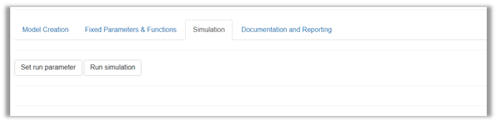

## Simulation settings

Before running the simulation, you may **set run parameters** to control
the default settings of the simulation. This can be useful to increase
the efficiency of the simulation. Depending on whether your model
involves a one-dimensional (1D) or two-dimensional (2D) simulation, the
number of replicates is given in general or separately for variability
and uncertainty
(<a href="#fig-setrunparameter" class="quarto-xref">Figure 18</a>).

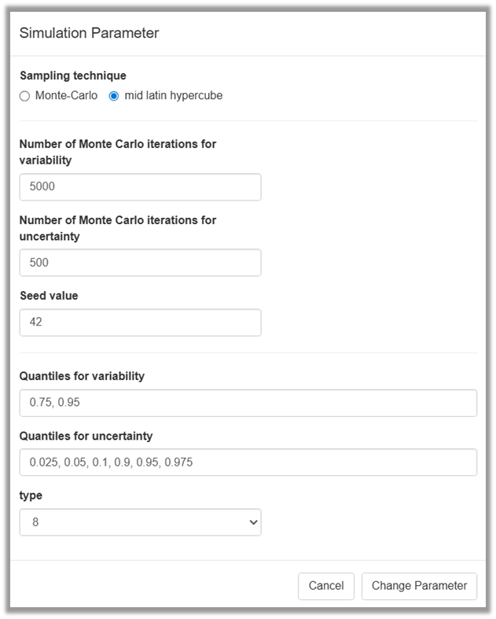

|                                                                                                          |                                                                                                                                  |
|----------------------------------------------------------------------------------------------------------|----------------------------------------------------------------------------------------------------------------------------------|
| Sampling technique                                                    | Choose between Monte-Carlo (default) and latin hypercube (enhanced efficiency)                                                   |
| Number of replicates\*                 | Enter the number of random samples for all distribution nodes (1D model)                                                         |
| Number of replicates\* for variability | Enter the number of random samples for nodes reflecting variability (2D model)                                                   |
| Number of replicates\* for uncertainty | Enter the number of random samples for nodes reflecting uncertainty (2D model)                                                   |
| Seed value                                                            | Enter an integer number, which will allow to reproduce the random sampling results                                               |
| Type                                                                  | Select quantile algorithm for calculating the percentiles                                                                        |
| \*                                                                        | “Monte Carlo iterations” will be replaced with “replicates” since this applies to both Monte Carlo and latin hypercube sampling. |

The setting of the **Sampling technique**, Monte Carlo (MC) versus mid
latin hypercube (LH), is a technicality that can be ignored unless you
have a specific preference (read more about sampling method below).

The **Number of replicates** allows you to to set the sample size for
the simulation that is adequate for the modelling task (read more about
number of replicates below).

Documentation of the **Seed value** allows you to exactly reproduce the
numerical results of your model. This is possible because the random
number generation uses a fully deterministic process. However, for
practical purposes, the numbers generated using both the MC and LH
algorithms can be assumed to be random, independent and identically
distributed. The term “random” sample will be used for both MC and LH
sampling techniques.

The default setting of the **Type** for calculating percentiles follows
the recommendation given by the developers of R’s “quantile” function
(see
[documentation](https://www.rdocumentation.org/packages/stats/versions/3.6.2/topics/quantile)),
which is part of the R “stats” package (R Core Team, 2024. R: A Language
and Environment for Statistical Computing. R Foundation for Statistical
Computing, Vienna, Austria. <https://www.R-project.org/>).

> [!WARNING]
>
> ### Memory
>
> The shiny rrisk server allocates a fixed size of memory to run the
> simulation. The amount of memory used is influenced by the number of
> nodes and the number of samples requested in the variability and
> uncertainty dimensions.

> [!TIP]
>
> ### Good practice - Number of replicates
>
> Since the number of nodes is given by the structure of the model, the
> amount of memory used will mainly depend on the number of random
> samples. Usually, the number of samples is selected based on standard
> “magic” numbers, like 100, 1000, 10000, etc. However, there are some
> approaches that can be followed as a guidance to estimate an
> approximate number. For the first approach you need the probability of
> the event being modelled as outcome (which is typically low in risk
> and exposure assessments) and the minimum expected **number of events
> you wish to model** to obtain a statistically meaningful result. Let
> $p$ denote the (low) true risk and $n$ the minimum expected number of
> occurrences of the event you wish to model. You can approximate the
> required number of replicates $N$ using
>
> $$N\ge n/p.$$
>
> For example, to observe at least $n=5$ events with a
> $p = 1/10000=10^{-4}$, you will need $N\ge=5*10^4$, at least 50,0000
> samples. Finding the appropriate number of samples is an iterative
> process, where different simulations are run until consistent values
> for up to two/three digits of the mean or median are obtained. The
> second and more general approach for assessing the required number of
> replicates uses the **convergence plot** (see below).

> [!TIP]
>
> ### Good practice - Choice of percentiles for numerical results
>
> The median as a measure of central tendency and 95th percentile for
> characterizing the spread towards more extreme outcomes are usually
> reported to characterize the variability of the outcome in exposure or
> risk models. If a 2D simulation has been conducted to account for
> parameter uncertainty, these outcome statistics are usually reported
> with a 95% uncertainty interval, i.e. an interval ranging from the
> 2.5th to the 97.5th percentile of the uncertainty distribution. If
> this interval is too wide to convey useful information, more narrow
> symmetrical intervals such as 10th and 90th percentile may be
> appropriate.

> [!CAUTION]
>
> ### Read more - Monte Carlo (MC) vs. latin hypercube (LH) sampling
>
> Two sampling methods can be used in shiny rrisk. The Latin Hypercube
> (LH) method is more efficient and will provide the same accuracy as
> the Monte Carlo (MC) method with fewer samples. In addition the LH
> will assure that samples are taken from the whole distribution, which
> is also better for rare events. The LH might reduce the number of
> samples required by a factor of 10 compared with the MC method. The LH
> is the default method in shiny rrisk.
>
> The LH method divides each random variable’s range into equal
> probability intervals (strata) according the number of samples
> required in the simulation and then take one sample from each interval
> per variable. Then the full coverage of each variable is sampled.
>
> <a href="#fig-mc_lh_v2" class="quarto-xref">Figure 19</a> shows two
> input parameters of the simple risk model $\mbox{Risk}=X_1*X_2$. Note
> that even with a small number of 80 sampling replicates, LH sampling
> results in a more homogeneous coverage of the sampling space as
> compared to the MC method.
>
> 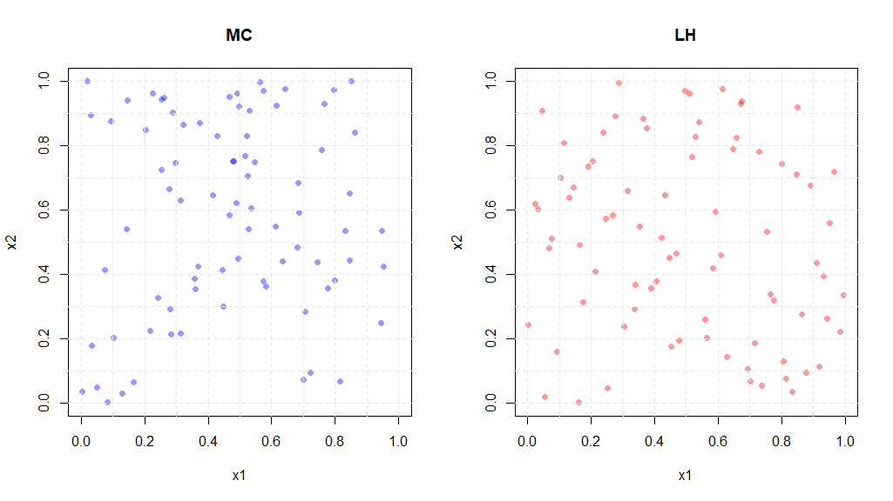
>
> The table below compare the sampling methods to the true risk after
> taken 80 samples for the two input variables. The risk estimated using
> LH sampling is more accurate than the MC estimate.
>
> |        Method        | Sample Size | Mean Risk | S.E.  |
> |:--------------------:|:-----------:|:---------:|:-----:|
> |         True         |     —-      |   0.017   |  \-   |
> |   Monte Carlo (MC)   |     80      |   0.038   | 0.021 |
> | Latin Hypercube (LH) |     80      |   0.013   | 0.012 |

## Run simulation

After setting all the parameters, select **Run Simulation.** After the
simulation is completed, shiny rrisk will present **general results**
and **sensitivity plot.**

### General results

Under **general results** you can access the numerical as well as the
graphical results of your model. The end node (final outcome of your
model) is shown by default. The results of any other node can be shown
by selecting the **Node** from the drop-down menu.

#### One-dimensional (1D) simulation

Shiny rrisk conducts a one-dimensional (1D) simulation, if none of the
distribution nodes is defined to represent uncertainty. In this case,
the numerical outcome consists of only one row of results, the **mean**,
**median**, standard deviation (**sd**), a selection of **percentiles**
(see Simulation settings) as well as the **unit**. This is shown using
the *Yersinia enterocolitica* in minced meat model as example. The
median and 95th percentile of the outcome (N_cg) is 0 and 89 colony
forming units (CFU), respectively
(<a href="#fig-general_results_out_1D" class="quarto-xref">Figure 20</a>).

#### Two-dimensional (2D) simulation

Shiny rrisk conducts a two-dimensional (2D) simulation, if at least one
of the distribution nodes is defined to represent uncertainty. In this
case, the numerical outcome consists of columns as defined for 1D models
(see above) and rows for the **mean**, **median**, standard deviation
(**sd**), a selection of **percentiles** for the uncertainty dimension
(see Simulation settings). This is shown using the *E. coli* in beef
patties model as example. The 90% uncertainty interval for median and
95th percentile for the outcome (risk) is 0.003-0.087 and 0.442-1.0,
respectively
(<a href="#fig-general_results_out_2D" class="quarto-xref">Figure 21</a>).

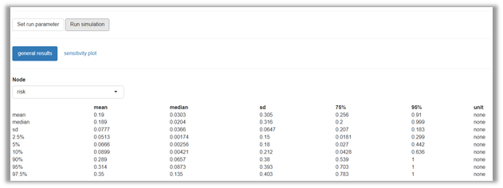

> [!CAUTION]
>
> ### Read more - Interpretation of percentiles
>
> Percentiles of the outcome function evaluated using shiny rrisk can be
> regarded as unbiased in a statistical sense. This property of
> probabilistic modelling is advantageous in comparison to a
> deterministic approach that would give you a biased result under
> general conditions.
>
> Assume you were interested in the high, say 95th percentile of the
> outcome distribution. This is typically the case to account for the
> high end of the range of outcomes consistent with the information
> captured in the model. Using a **deterministic approach**, you would
> use the “high risk percentiles” for each of the input variables.
> Multiplying the 95th percentiles of two random variables results in a
> larger value compared to the 95th percentile of the simulated product
> if the two factors are uncorrelated. Thus, the deterministic approach
> for evaluating high percentiles is biased towards high risk outcome.
>
> This effect is demonstrated using illustrative distributions
> representing variability in food consumption (FC) and substance
> concentration (SC). The product of the 95th percentiles is an
> overestimation of the 95th percentile of the exposure Ex=FC\*SC
> (<a href="#fig-BiasedP95" class="quarto-xref">Figure 22</a>).
>
> 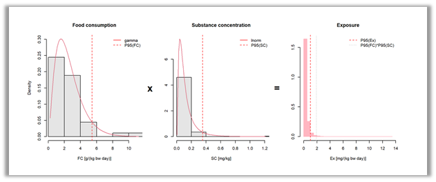

### Graphical results

Under **general results** you can also access the graphical results of
your model. The end node (final outcome of your model) is shown by
default. As for the numerical results, any any other node can be shown
by selecting the **Node** from the drop-down menu.

#### Histogramme

The histogramme depicts the density distribution of the random values
for the given node. There is no principal difference in appearance and
interpretation of a histogramme between 1D and 2D models and between end
nodes (outcome of the model) and any other distribution node
(<a href="#fig-histogramme" class="quarto-xref">Figure 23</a>). The
histogramme may reveal a non-homegeneous distribution of the outcome,
which can be due to the effect of some discrete parameters in the model
(see 2D example below).

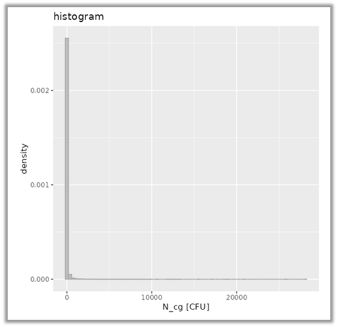

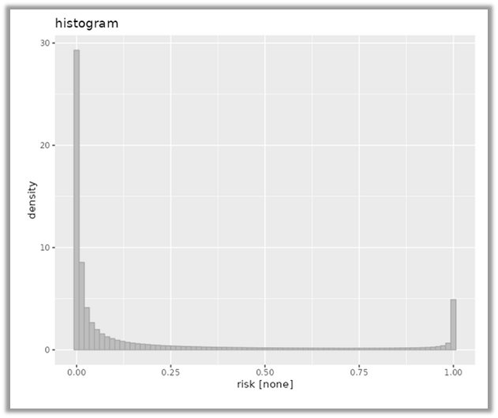

#### ECDF plot

The empirical cumulative density function (ECDF) is a line plot
connecting the empirical quantiles of the distribution (x-axis) plotted
against the cumulative probability (y-axis). This feature allows that an
uncertainty envelope is added in case of a 2D model. Thus, there is an
important difference in appearance and interpretation of the ECDF plot
between 1D and 2D models. Whereas uncertainty is not quantified in a 1D
model, the uncertainty envelope (50% and 75% shown be default)
visualizes the uncertainty at each cumulative probability for a 2D model
(<a href="#fig-ecdf" class="quarto-xref">Figure 24</a>, see below for
further details).

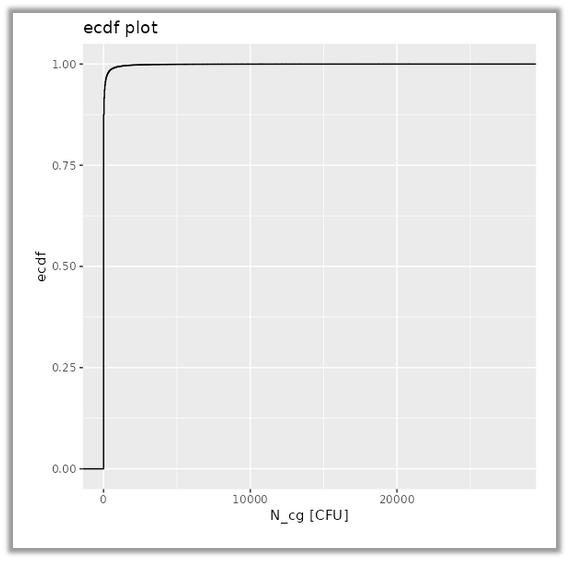

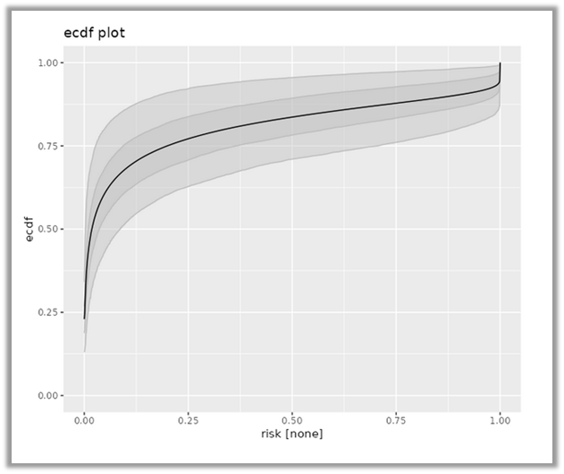

> [!CAUTION]
>
> ### Read more - Interpretation of 2D simulation plot
>
> The ECDF plot for a 2D model depicts the outcome of the model in terms
> of both variability and uncertainty. The process of 2D modelling
> involves a repeated evaluation of the model whereby for each
> repetition single values are picked at random from the distributions
> representing uncertainty. This yields a large number of ECDF plots for
> variability which jointly visualize the effect of parameter
> uncertainty on the final outcome distribution
> (<a href="#fig-eufora-2D" class="quarto-xref">Figure 25</a>).
>
> 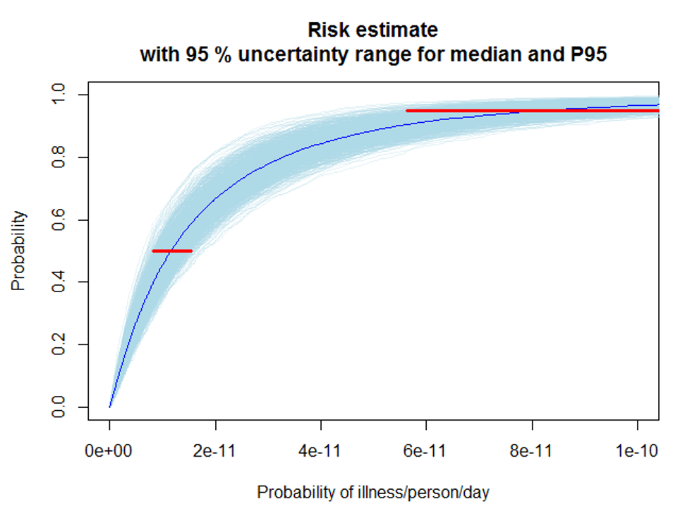
>
> The central tendency (median) of the risk estimate can be read from
> the intersection of the dark blue line with the red line parallel to
> the x-axis at a probability value of 0.5 (x-axis). The value is around
> 1e-11.
>
> The 95th percentile (P95) provides an estimate of the risk that
> captures 95% of the variability of the input parameters. It can be
> read from the x-axis where the upper red line intersects with the dark
> blue line. The value is around 1e-11.
>
> The uncertainty of the median and 95th can be read from range of
> x-values across the red lines for the two statistics. The uncertainty
> ranges are defined such that 95% (or another uncertainty interval) of
> the individual ECDF plots are covered at the given probability level.
>
> The shiny rrisk version of the ECDF plot for 2D models connects all
> such uncertainty ranges resulting in an uncertainty envelope (see
> <a href="#fig-ecdf" class="quarto-xref">Figure 24</a>, right panel).
> Note that ECDF plot are for visualization only. Numerical values
> should be read from the result table.

#### Convergence plot

The convergence plot displays the numerical result of your model as a
function of the cumulative number of replicates. Thus, it is a visual
aid to access whether convergence has been reached, i.e. a state where
no more changes in outcomes are seen when adding more replicates. While
a lot of random fluctuation is seen with low numbers of replicates, the
outcome tends to become more stable with an increasing cumulative number
(<a href="#fig-convergence" class="quarto-xref">Figure 26</a>). Final
inference should be made only on the basis of models that have
converged.

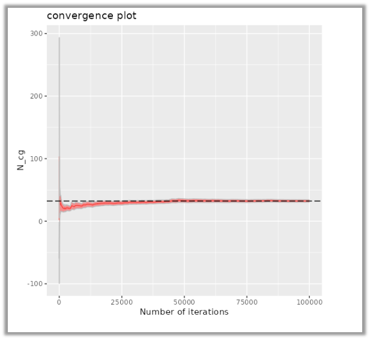

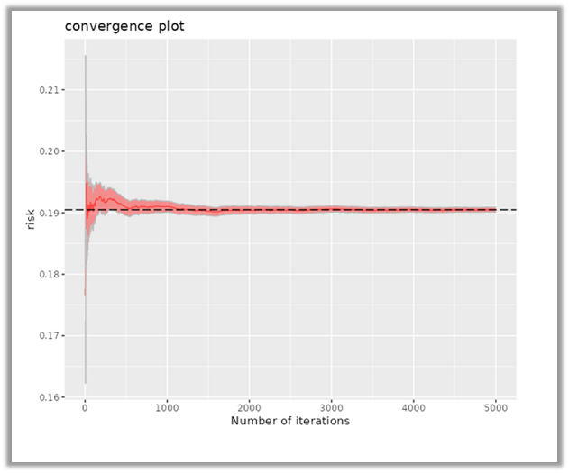

> [!CAUTION]
>
> ### Read more - Convergence
>
> Generally, it may take more replicates for a 2D to converge compared
> to a 1D model. However, convergence also depends on the number of
> distribution nodes and their respective shapes. Convergence may be
> improved by selecting latin hypercube sampling instead of Monte Carlo
> sampling
> (<a href="#fig-convergence-sampling" class="quarto-xref">Figure 27</a>).
>
> 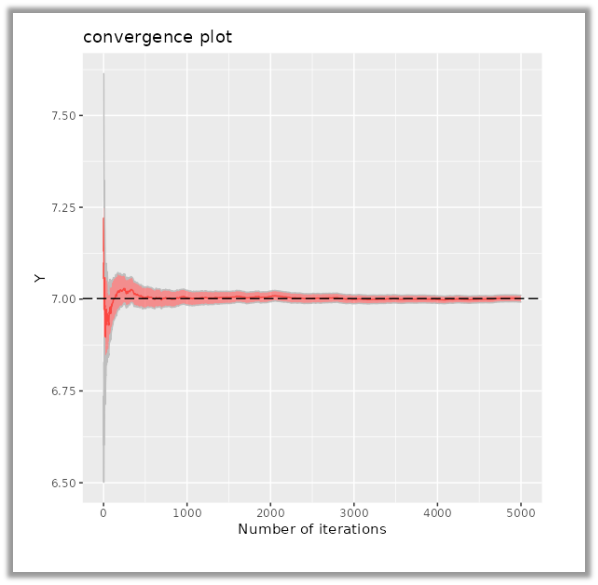 alt="Monte Carlo (MC) simulation (Alizarin red S in Eel model)" />
>
> 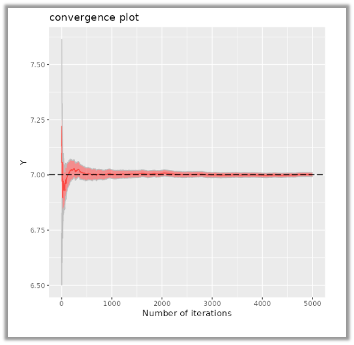 alt="Latin hypercube (LH) simulation (Alizarin red S in Eel model)" />

#### Sensitivity Plot

The sensitivity analysis in shiny rrisk explores the effect of model
input variables (distribution nodes) on the model outcome. The results
can be visualized by selecting the **sensitivity plot** tab in the main
screen after running the simulation
(<a href="#fig-sens_analysis-01" class="quarto-xref">Figure 28</a>).

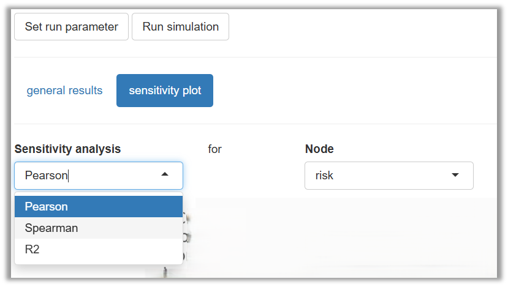

|                                             |                                                                                                      |
|---------------------------------------------|------------------------------------------------------------------------------------------------------|
| Pearson  | Correlation between model input and output quantified using Pearson product-moment correlation.      |
| Spearman | Correlation between model input and output quantified using Spearman’s rank correlation coefficient. |
| R2       | Correlation between model input and output quantified using r-squared (not yet implemented).         |

The correlation statistics are visualised as a vertical bar chart,
whereby the bars are sorted from high to low, which is commonly referred
to as a **tornado plot**. In case of 2d models, the statistics are
presented with 95% uncertainty intervals.

The tornado plots below use the Pearson statistic for quantifying the
sensitivity for two models
(<a href="#fig-sensitivity-comparsion" class="quarto-xref">Figure 29</a>).
The plot for the 1D model (*Yersinia enterocolitica* in minced meat)
reveals that five distributions have a weak positive correlation, the
number of *Y. enterocolitica* in one package of minced meat after
storage at retail (N_rg) being the most influential one. The plot for
the 2D model (*E. coli* in beef patties) shows that the distribution of
the initial concentration based on 18 fictitious counts of *E. coli*
O157:H7 (log10_C0) has a moderate positive correlation with the model
outcome. Since this is a 2D model, the tornado plot also presents 95%
uncertainty ranges. Thus, the impact of log10_CO in the model outcome is
significantly higher compared to the reduction factor, also when
accounting for parameter uncertainty (uncertainty intervals are not
overlapping).

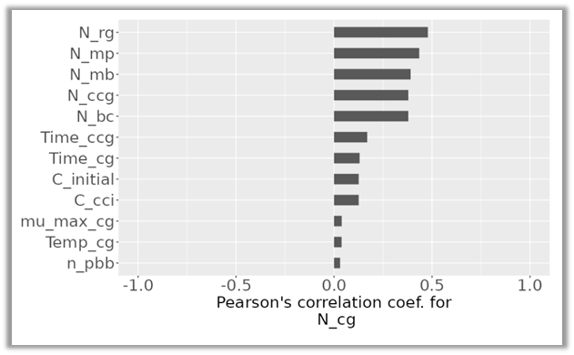

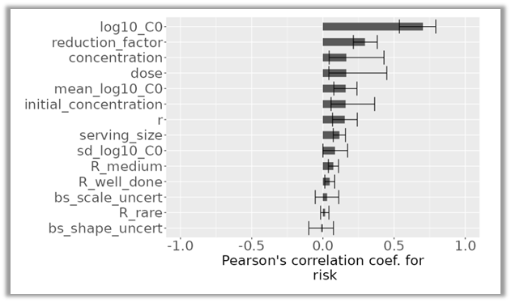

> [!CAUTION]
>
> ### Read more: Tornado plots
>
> Tornado plots are commonly used in risk and exposure assessments
> models to assess the quantify the impact of input variables on the
> outcome of the model. This relationship is quantified using parametric
> (e.g. Pearson correlation coefficient) or non-parametric
> (e.g. Spearman rank correlation coefficient - rho -) statistics.
>
> The graphs is created using all the input variables on the y-axis and
> the statistic on the x-axis, then the relationship is depicted using
> horizontal bars where the length of the bar represents the value of
> the statistic. This value is constraint by the boundaries of the
> statistic (e.g. between -1 and 1). Where values below 0 represent an
> inverse relationship and values greater than 0, otherwise. For
> instance negative values suggest that higher values of the input are
> associates with lower values of the outcome variable.
>
> In addition, for 2D models, each input variable has a line indicating
> the 95% probability interval of the relationship due to the
> uncertainty propagated in the model.
>
> **Pearson correlation coefficient**. The relationship is captured
> assuming a linear relationship between the input variable and the
> outcome using the Pearson correlation coefficient.
>
> **Spearman rank correlation**. The relationship is captured using the
> non-parametric rank correlation which does not assume any particulate
> shape of the relationship between the input and outcome.
>
> This graphs are called “tornado” because the shape of the graphs
> resembles a “tornado”, funnel like shape since the variables are
> sorted from highest values on the top to the lowest at the bottom.

