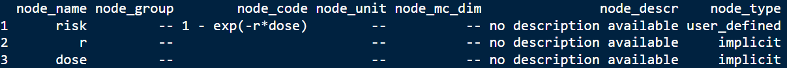
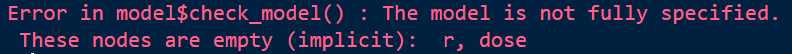
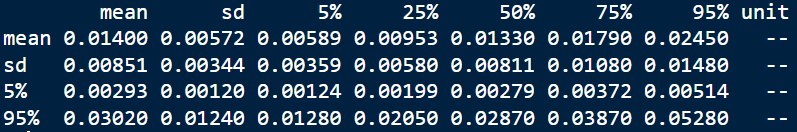
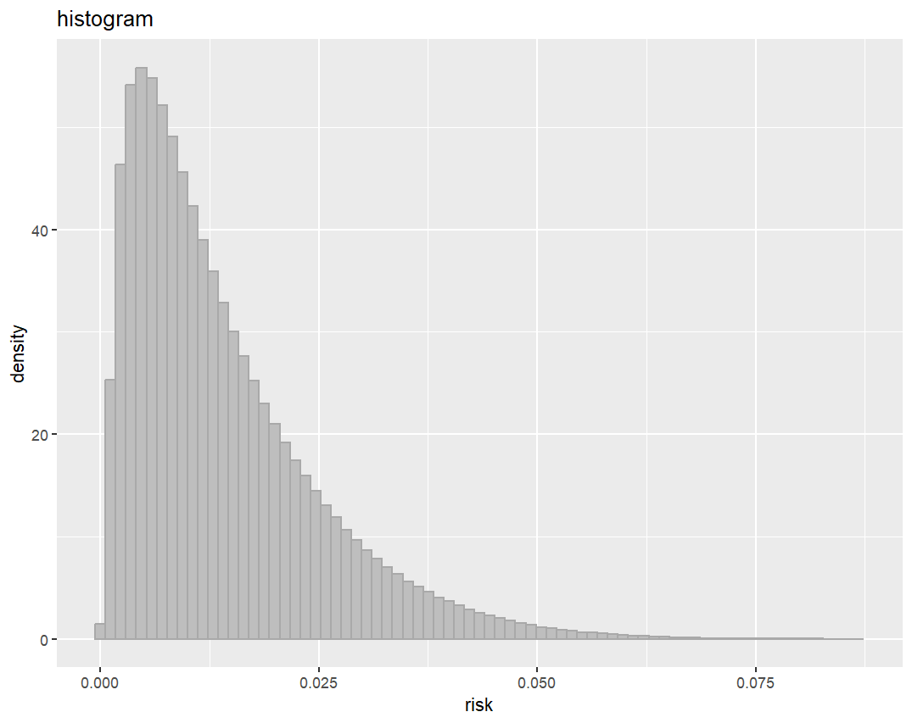
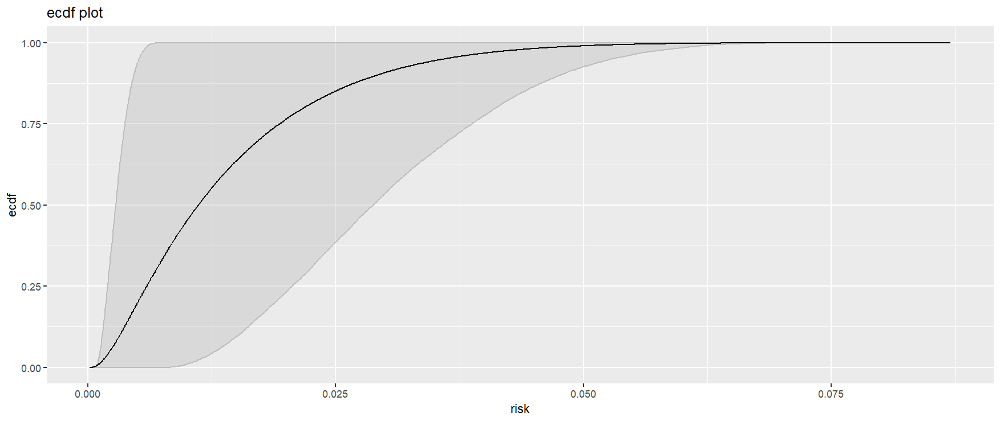

# Introduction to rrisk

The software rrisk allows the writing of complex exposure and risk models and assessment, and their documentation, in R.

## Quick start

First source rrisk.

```R
source(rrisk)
```

rrisk is written as an [R6 class](https://r6.r-lib.org/articles/Introduction.html). As a result it behave like classical object oriented class as in C++ or Python.
The main object in rrisk is the `rriskModelClass`. You can then instanciated a new empty rrisk model from this class:

```R
model <- rriskModelClass$new()
```

### Build a model

Then you can fill the new model:

```R
model$add_node(node_name     = "risk",
               user_def_expr = "1 - exp(-r * dose)")
```

I added a node named *risk* that containes a user defined expression. Here the node risk contains a simple model equation for getting sick after ingesting a certain dose of a microbe or substance (later we will refine this node by using the numerical better expression `-expm1(-r*dose)`).

We can plot the model graph with:

```R
model$plot_model_graph()
```

The output should look like this:

<div class="img-with-text">
    
    <p>Plot of model graph. It contains the defined node <i>risk</i>, and additionally the two implictly defined nodes <i>r</i> and <i>dose</i></p>
</div>

The graph contains already three nodes: the user added node `risk`, and the two nodes `r` and `dose`. The last two nodes were implicitly defined by the user through the `user_def_expr`.

The node `risk` is a so-called *end node*, as it is at the end of graph. Usually, these nodes contain the outcome of interest.

We can check the content of the model by printing the nodes as a data frame:

```R
model$get_df_nodes()
```

The result should look like this:

<div class="img-with-text">
    
    <p>The current model as a data frame</p>
</div>

The table shows what information is already added to the model. We can add more information to each node as we currently did.

We can check the model:

```R
model$check_model()
```

<div class="img-with-text">
    
    <p>The result of this model check: the model is not fully specified, as <i>r</i> and <i>dose</i> are not fully defined yet.</p>
</div>

We add the missing to nodes. Both nodes are containing a parametric distribution. In rrisk, a so-called 2D-Monte-Carlo simulation is possible. Here we put the distribution for `dose`on the first MC dimension, and the distribution for `r` and the second MC dimension. The first MC dimension is often associated with a variable, and the second MC dimension with a uncertain variable.

```R
model$add_node(node_name  = "dose",
               param_dist = list(name = "pert",
                                 def  = list(min   = 10,
                                             mode  = 30,
                                             max   = 100,
                                             shape = 4)),
               mc_dim     = 1L)

model$add_node(node_name  = "r",
               param_dist = list(name = "triang",
                                 def  = list(min  = 1e-5,
                                             mode = 1e-4,
                                             max  = 1e-3)),
               mc_dim     = 2L)
```

The model is no fully determined.

### Run simulation and evaluate results

```R
model$run_simulation()
```

Get a summary of the results for node `risk`:

```R
model$get_result_summary("risk")
```

<div class="img-with-text">
    
    <p>Result summary for node <i>risk</i></p>
</div>

Result plots for `risk`

Histogram as approximation for the probability distribution function.

```R
model$plot_histogram("risk")
```
<div class="img-with-text">
    
    <p>Histogram for node <i>risk</i></p>
</div>

empirical cumulative distriution function

```R
model$plot_ecdf("risk")
```

<div class="img-with-text">
    
    <p>Empirical cumulative distribution function for node <i>risk</i></p>
</div>
