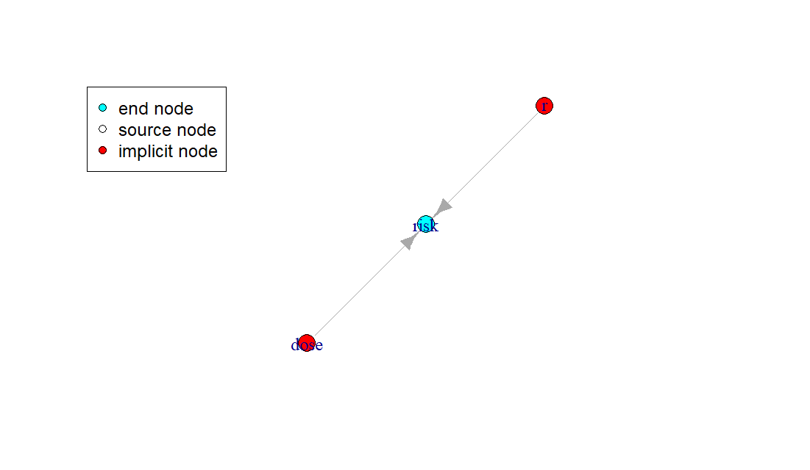

# Introduction to rrisk

The software rrisk allows the writing of complex exposure and risk models and assessment, and their documentation, in R.

## Quik start

First source rrisk.

```R
source(rrisk)
```

rrisk is written as an [R6 class](https://r6.r-lib.org/articles/Introduction.html). As a result it behave like classical object oriented class as in C++ or Python.
The main object in rrisk is the `rriskModelClass`. You can then instanciated a new empty rrisk model from this class:

```R
model <- rriskModelClass$new()
```

Then you can fill the new model:

```R
model$add_node(node_name     = "risk",
               user_def_expr = "1 - exp(-r * dose)")
```

I added a node named *risk* that containes a user defined expression. Here the risk of getting sick after ingesting a certain dose of a microbe or substance (later we will refine
this node by using the numerical better expression `-expm1(-r*dose)`).

We can plot the model graph with:

```R
model$plot_model_graph()
```

The output should look like this:

<div class="img-with-text">
    
    <p>Plot of model graph. It contains the defined node <i>risk</i>, and additionally the two implictly defined nodes <i>r</i> and <i>dose</i></p>
</div>
